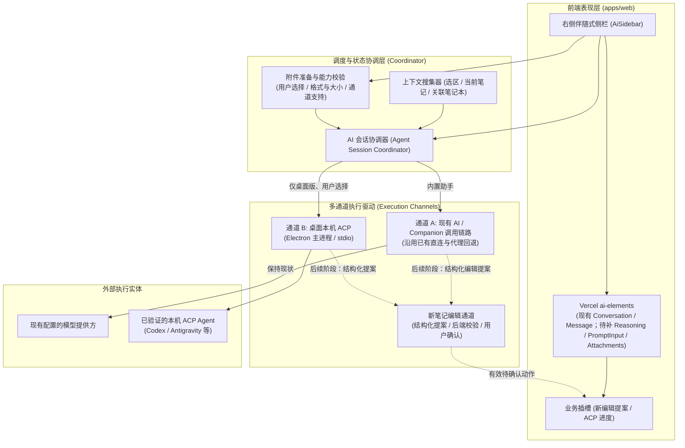
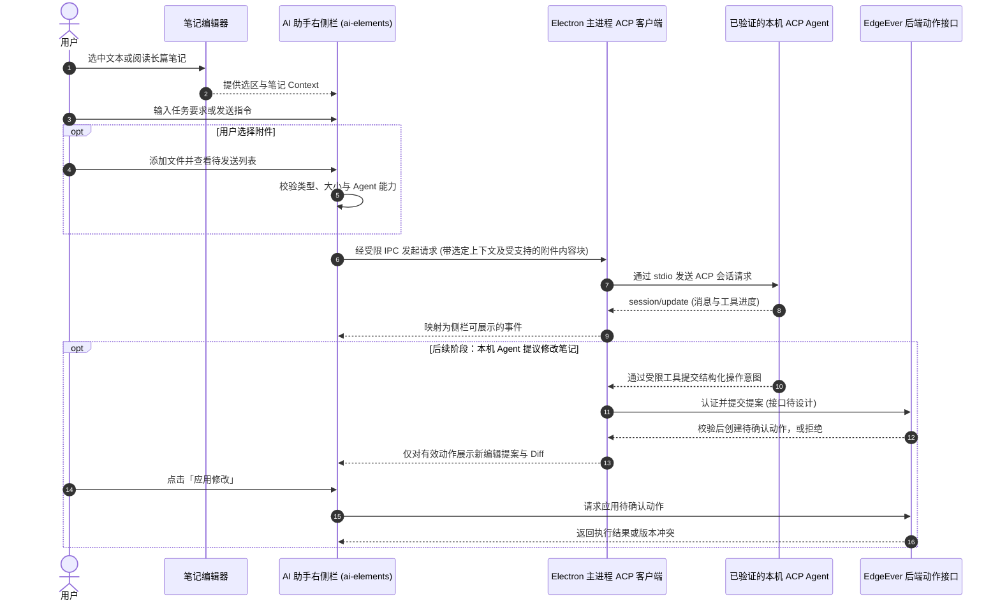

# EdgeEver AI 助手重构与本地 Agent 接入方案设计

本文档面向 EdgeEver 核心团队，梳理并评估 AI 助手交互升级、UI 组件重构、模式收敛以及本地 AI Agent（Codex、Antigravity 等）调用的落地技术方案。

---

## 1. 背景与目标

### 1.1 现状与痛点
* **浮层遮挡正文**：当前 AI 助手采用可拖拽悬浮对话框（`AiAssistantDialog.tsx`，1100+ 行代码），居中或锚定在编辑器上方，严重阻挡笔记正文与光标上下文，用户无法在长文写作时“一边参照正文一边与 AI 协作”。
* **双模式割裂（心智负担）**：界面顶部设有“问答模式”和“Agent 模式”两个切换 Tab。实际上，“问答模式”本质是单轮指令改写（翻译、润色、总结），而“Agent 模式”是带全库工具调用的多轮对话。这种人为拆分给用户带来了多余的决策负担。
* **重复造轮子**：手写了大量拖拽位移、滚动吸底、浮动层级管理、气泡渲染与输入框状态，维护成本高且未完全发挥系统内 `shadcn/ui` 与已引入的 `ai-elements` 的模块化优势。
* **孤立于本地开发/本地 Agent 生态**：用户希望在笔记中直接调用本机已经安装配置好的自主 Agent（如 Codex、Antigravity、Claude Code 等），但缺少标准化、轻量可靠的桥接路径。

### 1.2 重构目标
1. **交互形态升级**：由“居中浮动弹窗”升级为现代知识工具标准的“右侧伴随式侧边栏（Right Sidebar）”，支持宽度调节与自适应折叠。
2. **UI 组件标准化**：全面基于 Vercel `ai-elements`（与项目 `shadcn/ui` 深度整合）重构对话流、思考链（Reasoning）与状态展示，彻底消除手工样板代码。
3. **消除模式割裂**：废弃多余的“问答 vs Agent”双 Tab，统一收敛为单一的全局 Companion Agent；常用写作意图通过快捷技能（Skills / Slash Commands）触发，选区作为 Agent 上下文。旧问答和行内改写链路不作为新架构的兼容目标。
4. **标准化本地 Agent 接入**：采用轻量且符合行业开放标准的 **ACP (Agent Client Protocol)** 及本地服务通道，让 EdgeEver 能够丝滑调度本机已有的 AI Agent。
5. **附件成为基础输入**：统一 Agent 支持用户主动添加图片、PDF 与常见文本文件，用于分析截图、文档和资料；附件必须真正送达所选执行通道，不以仅有上传按钮或文件名展示作为完成标准。

---

## 2. 关键技术选型与架构决策

### 决策一：采用 ACP (Agent Client Protocol) 连接本地 Agent

* **核心结论**：桌面版以 **`@agentclientprotocol/sdk` (ACP)** 作为本地 Agent 的首选接入协议。AI SDK Harness 并非不能在本机运行，但其沙箱、会话和适配层不直接解决“调用用户电脑上已配置 Agent”的需求，本阶段不引入。
* **背景与定位**：ACP 标准化客户端与 Agent 之间的会话、进度和权限交互，适合由 EdgeEver 桌面应用充当客户端。首版采用稳定的 ACP v1；是否支持某个 Agent，以具体 ACP 适配器和真实握手结果为准。[ACP 协议概览](https://agentclientprotocol.com/protocol/v1/overview)
* **通信方式**：
  * **首版本地子进程模式**：Electron 主进程启动明确支持的 ACP 服务程序，通过 JSON-RPC over `stdio` 通信，渲染进程只通过受限的 preload / IPC 接口发送请求与接收事件。Codex 对应 [codex-acp](https://github.com/agentclientprotocol/codex-acp)，Antigravity 对应 [ACP 注册表中的适配器](https://github.com/agentclientprotocol/registry/blob/main/antigravity-acp/agent.json)；普通 `codex`、`agy` 命令或已打开的桌面 App 不能直接视为 ACP 服务。其他 Agent 逐个验证后再加入。
  * **远程连接暂不纳入首版**：ACP 也面向远程场景，但 HTTP / WebSocket 的完整支持仍在演进；不让网页前端自行连接任意 `127.0.0.1` 端口。
* **协议优势与边界**：ACP 提供 `initialize`、认证协商、会话创建与可选续接、进度通知、取消及权限请求等接口；具体能力取决于 Agent 握手声明，文件 Diff 也不等于 EdgeEver 笔记修改提案。
* **附件能力边界**：`session/prompt` 可以携带内容块，但图片与内嵌资源分别受 Agent 的 `promptCapabilities.image`、`promptCapabilities.embeddedContext` 约束；不能因侧栏允许选择文件，就假定每个 ACP 适配器都能读取它。[ACP 提示内容](https://agentclientprotocol.com/protocol/v1/prompt-turn) · [ACP 能力协商](https://agentclientprotocol.com/protocol/v1/initialization)
* **本地 Agent 可用性验证**：
  * 用户选择 Agent 时，先查找已知 ACP 适配器的可执行程序，允许手动指定路径；不扫描凭据目录，也不根据某个 App 是否安装推断登录状态。
  * 通过 `initialize` 和必要的认证流程区分“程序存在”“需要登录”“可建立会话”“连接失败”。只有完成握手并成功建立会话才显示可用；复用本机登录态须逐个适配器实测。
  * 首版提供安装与配置指引；自动下载或安装可执行程序留待来源校验、更新和跨平台策略明确之后。

---

### 决策二：基于 `ai-elements` 重构 UI 交互层

* **评估结论**：**按需补齐 `ai-elements` 再重构对话 UI**。仓库目前只有 `conversation.tsx` 和 `message.tsx`；`Reasoning`、`PromptInput` 尚未引入，不能当成已具备的组件。
* **核心价值**：
  * 遵循项目“禁止重复造轮子、优先复用 `shadcn/ui`”的铁律。
  * 现有 `<Conversation>` / `<ConversationContent>` 提供对话容器与滚动控制；现有 `<Message>` / `<MessageContent>` / `<MessageResponse>` 用于消息布局与流式 Markdown。
  * 从官方组件仓库按需引入 `reasoning`、`prompt-input` 和 `attachments`；用 `<Reasoning>` / `<ReasoningTrigger>` / `<ReasoningContent>` 展示实际提供的推理内容，用 `<PromptInput>` 与 `<Attachments>` 等组件构建含附件的侧栏输入区。[Reasoning 文档](https://elements.ai-sdk.dev/components/reasoning) · [Prompt Input 文档](https://elements.ai-sdk.dev/components/prompt-input) · [Attachments 文档](https://elements.ai-sdk.dev/components/attachments)
  * `Thinking` 不作为独立组件或接入目标；若通道只提供运行状态而不提供推理文本，只展示状态，不伪造推理内容。
* **EdgeEver 专有能力适配**：
  * **新笔记编辑流程**：不要求复用旧 `CompanionActionCard` 或行内替换交互。后续以结构化编辑提案、EdgeEver 后端校验、Diff 预览和用户确认建立新的写入流程；ACP 工具事件与文件 Diff 可以展示执行进度，但不能直接转换成可应用的笔记动作。
  * **富文本渲染**：当前 `MessageResponse` 的 Streamdown 只配置了 `cjk`。`@streamdown/code`、`@streamdown/mermaid`、`@streamdown/math` 已在 Web 依赖中，但还需接入消息渲染，并检查插件样式与 KaTeX 样式。先明确插件只作用于新助手消息还是作用于共享的 `MessageResponse`；若修改共享组件，须同时回归使用它的信息图对话。[Streamdown 插件用法](https://streamdown.ai/docs/usage)

---

### 决策三：从浮窗 Dialog 演进为伴随式 Right Sidebar

* **评估结论**：**全面右侧栏化**。
* **交互形态规划**：
  * **桌面大屏端**：平级停靠在编辑器右侧，构成 `[导航栏] -> [笔记列表] -> [主编辑器] -> [AI 助手侧栏]`。
    * 支持折叠/展开快捷键（默认推荐 `Cmd/Ctrl + J` 或工具栏按钮）；
    * 支持拖拽边缘调整宽度（保存至 `localStorage`，默认推荐 380px，最小 320px，最大 560px）；
    * 彻底解决遮挡问题，用户可一边阅读/编写长笔记，一边观看 AI 推理。
  * **小屏/平板/手机端**：自动响应式降级。
    * 当编辑器宽度低于阈值（例如 `< 768px`）时，侧栏转为右侧滑出抽屉（Sheet / Drawer），关闭时不占用宝贵宽度。
  * **会话生命周期**：普通收起/展开侧栏或关闭/重开小屏抽屉只改变可见性，不卸载正在执行的会话组件；明确点击“停止”才取消任务。当前 `CompanionChat` 卸载时会中止请求，因此新布局须避免把“收起”直接实现为卸载。页面刷新、应用升级或进程退出可能中断进行中的会话，这一限制可以接受；不为跨升级续跑引入全局会话管理器或后台队列。
  * **选区感知（Context Linking）**：
    * 用户在编辑器中划选文本时，右侧栏输入框上方自动出现轻量选区徽标（如 `选中 320 字 · 当前笔记`）；
    * 用户提问时自动将选区作为上下文注入，无需二次复制粘贴。

---

### 决策四：砍掉“问答模式”，全面收敛到“统一 Agent”

* **评估结论**：**废弃模式切换 Tab 与旧编辑链路，统一为 Agent 交互，并在新架构上重新设计笔记编辑**。不以旧功能逐项对齐作为上线条件。
* **融合与收敛设计**：
  1. **主视口收敛**：删除顶部 `instruction`（问答）与 `ask`（Agent）切换栏，以及依赖旧问答链路的编辑入口；所有 AI 任务从侧栏发起。
  2. **常用写作意图作为 Agent 快捷入口**：
     * 总结、翻译、润色等可提供快捷技能胶囊（Pills）与斜杠命令（Slash Commands），其结果先作为 Agent 回复呈现，不承诺旧版的一键替换行为；
     * 编辑器选区随请求提供给 Agent，并在侧栏显示上下文徽标，避免用户重复复制。
  3. **重新设计笔记写入**：Agent 如需修改笔记，必须提交结构化提案；EdgeEver 后端校验目标、权限与版本后，侧栏展示 Diff，由用户确认后应用。旧气泡菜单的 AI 改写、行内 Diff、直接替换和 `CompanionActionCard` 均可随旧链路移除；新写入流程完成前，相关任务只返回文本建议。

---

### 决策五：附件作为统一 Agent 的基础输入能力

* **现状与结论**：旧问答界面已有文件选择、类型与大小校验，`ai-attachments.ts` 和共享 Schema 也有现成规则；当前 `CompanionTurnInputSchema` 没有附件字段，Companion 路由的请求体上限为 128 KB。新侧栏必须补齐从选择文件到 Agent 实际接收内容的整条链路，不能只迁移旧按钮，也不能把大文件的 Base64 直接塞进现有回合请求。
* **首版输入范围**：以现有 AI 附件白名单和限制为基线：JPEG、PNG、WebP、GIF、PDF、JSON、TXT、Markdown、CSV；最多 4 个，单个非文本文件最多 4 MiB、文本文件最多 256 KiB，总计最多 8 MiB。继续复用现有校验规则，但具体模型或 Agent 不支持的类型必须在发送前明确提示，不默默忽略。[AI Elements 附件组件](https://elements.ai-sdk.dev/components/attachments)
* **交互与数据边界**：侧栏支持文件选择、拖入和粘贴图片；发送前展示文件名、类型/大小、缩略图或图标、移除操作和校验错误。仅发送用户本次明确选择的附件；不会自动附带当前笔记的全部资源。消息记录显示已发送附件的元数据，附件内容的保存期限、重试与清理策略需在实现前确定。
* **内置 Agent 通道**：扩展 Companion 回合输入、服务端校验与模型消息构造，并设计有大小上限、鉴权和过期清理的附件传递方式；保持现有模型直连/代理回退边界。若引入临时存储或迁移，按高风险变更验证旧版本到新版本的数据与请求链路。按模型实际能力处理图片和文件输入；不支持时在发送前拦截并说明原因。文件上传到笔记资源库与发送给 Agent 是不同动作，不因对话附件自动写入笔记。
* **本机 ACP 通道**：握手后按 `promptCapabilities` 转换已选附件；图片仅在支持 `image` 时发送，文本内容仅通过适配器支持的内容块安全传递，PDF 等二进制文件须验证该适配器确实可接收。仅有文件路径或文件名不算交付内容；不支持的附件保持在输入区并提示用户移除或切换 Agent，不静默丢弃。[ACP 内容块](https://agentclientprotocol.com/protocol/v1/content)

---

### 现有模型路由策略（保留）

EdgeEver 的 `packages/client/src/index.ts` 已实现模型 API 直连、浏览器端 CORS 探测及服务端代理回退；Companion 也已有相应的准备、执行和检查点接口。本方案保留路由策略，不新增“客户端永远直连”的原则；附件功能需要扩展 Companion 输入与模型消息，但不应无意改变凭据准备、服务端工具调用或回退行为。模型请求是否经过实例服务端，取决于运行环境、模型提供方和当前调用路径；隐私、延迟与带宽效果需按实际路径测量，不能一概保证。

---

## 3. 系统架构设计

### 3.1 架构分层图

### 3.2 交互时序图（本地 Agent 调度示例）

本机 ACP 首版仅向 Agent 提供用户选定的只读笔记上下文和明确添加且受适配器支持的附件，不提供写入 EdgeEver 的工具；Agent 自身的本机工具权限另按其适配器配置。ACP 的工具事件或文件 Diff 不会自动成为 EdgeEver 笔记操作；开放笔记写入前必须另行设计受限工具、结构化提案、工作区权限、笔记版本校验和服务端确认接口，禁止本机 Agent 绕过现有门禁直接改写笔记。

---

## 4. 变更风险与防范预案

依据 `AGENTS.md` 核心评估原则，对本次变更进行边界控制：

| 评估维度 | 详细说明 |
| :--- | :--- |
| **功能价值** | 彻底消除弹窗遮挡编辑器的交互硬伤；减少手写冗余代码；统一操作心智；让图片、PDF 与文本资料真正进入 Agent 上下文；打通本地 Agent 生态。 |
| **影响范围** | `apps/web/src/components/EditorPane.tsx` 布局容器、`apps/web/src/components/dialogs/AiAssistantDialog.tsx`（废弃并替换）、旧问答与行内 AI 编辑入口、原有动作卡片交互、`WorkspaceApp.tsx` 侧栏布局与组件挂载、AI 附件准备逻辑、Companion 输入 Schema/路由/模型消息、Electron ACP 桥接和 i18n 文案。 |
| **最坏后果** | 1. 窄屏下侧边栏挤压主编辑器可视区； 2. 旧版一键改写与行内替换被移除后，在新编辑流程上线前，用户只能获取文本建议并手动修改笔记； 3. 附件被静默遗漏、误发给错误通道，或大文件使请求失败； 4. 误把收起侧栏实现为卸载，导致进行中的任务意外中断；刷新或升级时任务也可能中断； 5. 本地连接异常时出现无响应等待； 6. 若错误地将 Agent 输出当成可信笔记动作，可能覆盖旧内容或绕过写入确认。 |
| **回滚与防范方案** | 1. **弹性布局**：严格设定桌面最小断点，小屏强制降级为遮罩抽屉（Drawer）； 2. **明确过渡能力**：新编辑流程完成前，只提供 Agent 回复和人工编辑，不保留旧行内写入实现； 3. **附件独立开关**：附件通路异常时可关闭该能力，纯文本会话继续可用；发送前校验目标通道与文件内容，不允许静默降级； 4. **轻量生命周期约定**：收起侧栏不卸载会话，停止任务走显式操作；接受刷新、升级和进程退出造成的中断，不承诺跨升级恢复； 5. **版本回滚**：保留模型调用链路，新版体验不可接受时通过版本回滚恢复旧实现； 6. **写入门禁与连接状态**：未经后端校验和用户确认不得应用提案；本地通道区分程序未找到、需要登录、会话可用和连接失败。 |
| **跨运行时验证项** | 严格禁止在核心 Server 代码中引入 Node 本地沙箱依赖，确保 Cloudflare Workers 与 Docker 镜像构建 100% 保持纯净与通过。 |

---

## 5. 分阶段实施路线图

### 第一阶段：右侧栏容器搭建与布局响应化（Foundation）
- [ ] 在 `WorkspaceApp.tsx` / `EditorPane.tsx` 建立右侧扩展面板插槽（`AiSidebar`）。
- [ ] 实现侧边栏的展开/折叠状态管理、键盘快捷键（`Cmd/Ctrl + J`）以及宽度拖拽调宽（支持 `localStorage` 记忆）。
- [ ] 完成小屏断点响应：`width < 768px` 时降级为浮动抽屉（Sheet）。
- [ ] 验证进行中任务在桌面收起/展开和小屏抽屉关闭/重开后继续运行；显式停止才取消。刷新或升级时的中断按已接受的限制处理，不建设跨升级续跑机制。

### 第二阶段：基于 `ai-elements` 重构对话流（UI Modernization）
- [ ] 复用已有 `conversation.tsx` 和 `message.tsx`，从官方 AI Elements 组件仓库按需引入 `reasoning`、`prompt-input`、`attachments`，核对新增依赖与项目现有 `shadcn/ui` 版本；不自行仿写同名组件，也不安装整套组件。
- [ ] 用 `<Conversation>` / `<ConversationContent>` / `<Message>` / `<MessageResponse>` 组成对话主视口；用 `<PromptInput>` 及其子组件构建文本输入、发送、运行状态和附件入口，用 `<Attachments>` 展示待发送与已发送文件。
- [ ] 复用 `ai-attachments.ts` 与共享附件限制，完成文件选择、拖入、粘贴图片、预览、移除及错误提示；文件发送中、失败和重试时保持可理解的状态。
- [ ] 仅在执行通道提供推理内容时，用 `<Reasoning>` / `<ReasoningTrigger>` / `<ReasoningContent>` 折叠展示；其他运行状态单独呈现。
- [ ] 为后续 ACP 工具进度预留消息插槽；新笔记编辑提案卡片在写入流程阶段单独设计，不迁移旧 `CompanionActionCard`。
- [ ] 为 AI 消息接入所需的 `@streamdown/code`、`@streamdown/mermaid`、`@streamdown/math`（保留 `cjk`），核对插件样式来源与 KaTeX 样式；验证流式 Markdown、代码块、Mermaid、行内与块级公式的显示。
- [ ] 若插件配置放在共享 `MessageResponse`，回归信息图对话的显示与加载表现；如有相互影响，则由新侧栏单独配置插件。

### 第三阶段：模式收敛与快捷技能（Simplification）
- [ ] 在移除旧问答模式前，打通新内置 Agent 的附件输入：扩展 Companion 回合 Schema、鉴权与大小控制、文件传递和模型消息构造；现有 128 KB 回合请求体上限不能直接承载大文件 Base64。
- [ ] 按提供方/模型能力验证图片、PDF 与文本文件；不支持的类型在发送前提示，不因某种模型不支持就默默删掉附件。明确附件内容在会话历史、重试与过期清理中的生命周期。
- [ ] 附件验收覆盖文件选择、拖入、粘贴、移除、超限与不支持格式、发送失败后重试，以及附件确实出现在 Agent 输入中；分别验证直连与代理回退路径。完成这项验收后再移除旧问答入口。
- [ ] 移除旧界面的“问答/Agent”模式切换 Tab。
- [ ] 移除旧问答编辑入口、气泡菜单 AI 改写和行内替换链路；不以旧功能逐项对齐作为验收标准。
- [ ] 将常用写作意图（总结、润色、翻译等）改造为输入框快捷技能胶囊（Pills）与斜杠命令（Slash Commands），结果先作为 Agent 回复呈现。
- [ ] 优化编辑器选区联动：选中文字即在侧栏顶部挂载 Context Badge。
- [ ] 验证多语言（zh-CN, en-US, ja, zh-TW）文案的同步清理与统一。

### 第四阶段：本地 Agent 桥接与协议接入（Local Agent Connectivity）
- [ ] 引入 `@agentclientprotocol/sdk`，在 Electron 主进程封装 ACP v1 `stdio` 客户端，并通过受限 preload / IPC 向侧栏传递事件。
- [ ] 实现桌面端**本机 ACP Agent 可用性验证**：
  * 只查找明确支持的 ACP 适配器可执行程序，并允许用户手动指定路径；不读取登录凭据目录。
  * 完成 `initialize`、必要的认证流程与会话创建，再显示“可用”；分别展示未安装、需登录、连接失败等状态。
  * 首版提供安装与配置指引，不自动下载或安装二进制程序；按平台验证登录态是否能够复用。
- [ ] 在设置中增加“Agent 来源”选择项：
  * **内置服务模式**（默认）：继续连接当前 EdgeEver 后端 / Companion 接口；
  * **本地 Agent 模式**：桌面版从已验证的 ACP 适配器中选择，支持手动指定适配器程序路径；首版不接受任意本地网络地址。
- [ ] 分别联调 Codex 与 Antigravity 的 ACP 适配器，验证握手、认证、真实会话、流式事件、取消和只读笔记上下文；其他 Agent 通过同样的验证后再加入。
- [ ] 对每个本机 ACP 适配器验证图片与文件内容块能力；支持的附件能够真实进入会话，不支持时保留待发送列表并明确提示，不将本机任意路径自动暴露给 Agent。
- [ ] 若后续开放本机 Agent 修改笔记，先完成服务端结构化提案与确认门禁设计，并验证版本冲突与失败恢复；不得将 ACP 文件 Diff 直接交给编辑器写入。

### 第五阶段：新架构下的笔记编辑（New Editing Flow）
- [ ] 定义 Agent 编辑提案的数据结构与受限接口，由 EdgeEver 后端校验笔记目标、权限、内容范围和版本；内置 Agent 先接入，本机 ACP Agent 在工具权限边界明确后接入。
- [ ] 在侧栏设计新的提案预览与 Diff 确认交互；用户拒绝、取消或关闭侧栏时不得写入，确认后才应用。
- [ ] 按新流程验收：选区与目标笔记正确、提案可理解、确认后内容正确、拒绝或取消无写入、版本冲突不覆盖新内容、失败后状态可恢复。无需补齐旧版一键改写、行内 Diff 或替换操作。
