# EdgeEver 场景与最佳实践

收集与整理 EdgeEver 在日常工作、学习和知识管理中的核心场景与高效实操案例，持续更新。
## 目录

- [1. 微信聊天记录一键归档与整理](#1-微信聊天记录一键归档与整理)
- [2. 小红书图文笔记一键剪藏](#2-小红书图文笔记一键剪藏)
- [3. X (Twitter) 推文与引用一键剪藏](#3-x-twitter-推文与引用一键剪藏)
- [4. 知乎回答与文章一键精准剪藏](#4-知乎回答与文章一键精准剪藏)
- [5. Reddit 讨论帖一键剪藏](#5-reddit-讨论帖一键剪藏)
- [6. 一键复制笔记到微信公众号排版](#6-一键复制笔记到微信公众号排版)
- [7. AI RSS 智能订阅日报与精美长图分享](#7-ai-rss-智能订阅日报与精美长图分享)
- [8. GitHub 开源仓库信息一键剪藏](#8-github-开源仓库信息一键剪藏)
- [9. 移动端社媒图片一键转存笔记](#9-移动端社媒图片一键转存笔记)
- [10. 手机端一键剪藏微信公众号文章](#10-手机端一键剪藏微信公众号文章)
- [11. AI 对话一键生成思维导图、流程图与架构图](#11-ai-对话一键生成思维导图流程图与架构图)
- [12. AI 智能生成专业信息图（时间线、对比图、架构图等）](#12-ai-智能生成专业信息图时间线对比图架构图等)
- [13. 借助右侧 AI 助手一句话生成多维表格](#13-借助右侧-ai-助手一句话生成多维表格)
- [14. 多维表格一键生成在线公开收集表单](#14-多维表格一键生成在线公开收集表单)

---

## 1. 微信聊天记录一键归档与整理

在微信中多选对话并点击「合并转发」，在「转发到其他应用」中选择 **EdgeEver**，即可一键将整段聊天记录转换为格式工整的结构化笔记。

对话中的发言人、时间轴、微信表情和超链接会被自动解析与排版；图片会自动内嵌展示，文档与音视频文件（如 `.xlsx`、`.pdf`、`.mp4`）会自动转为笔记附件安全保存并支持全文检索。

| 1. 微信合并转发到 EdgeEver | 2. 自动生成结构化笔记 |
| :---: | :---: |
| 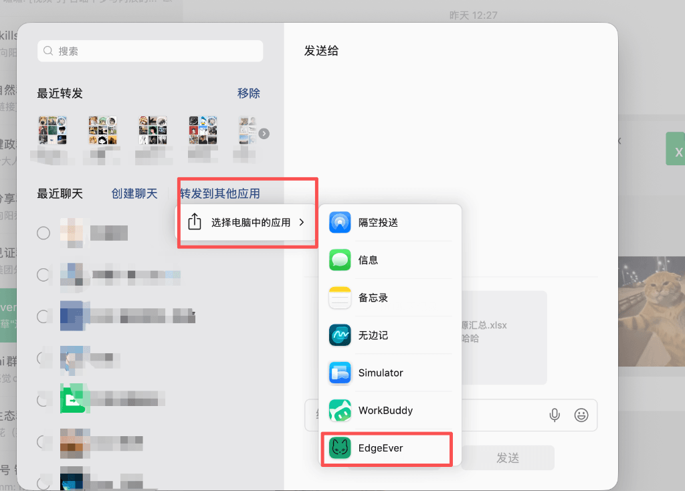 | 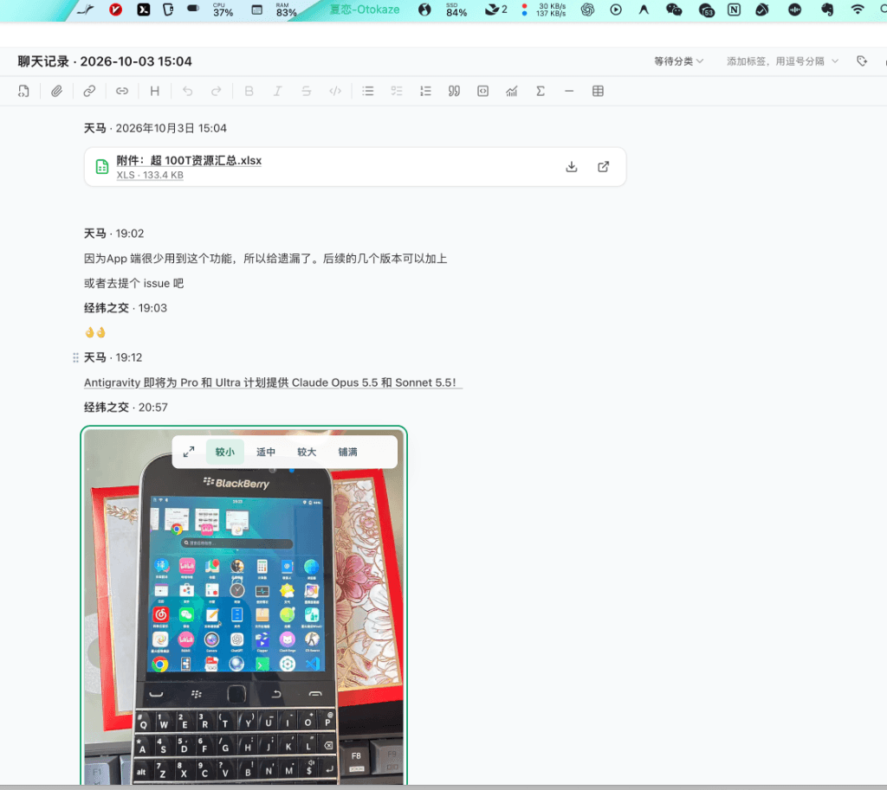 |

---

## 2. 小红书图文笔记一键剪藏

在浏览器中浏览小红书网页版时，通过 EdgeEver Web Clipper 插件右键点击「保存笔记到 EdgeEver」，即可一键完整转存图文内容。

标题、话题标签、正文、发布时间、地点及原文链接会被完整保留，组图高清无损转存并自动渲染为多栏画廊排版，打上 `#web-clip` 标签方便统一检索与灵感收集。

| 1. 网页右键「保存笔记到 EdgeEver」 | 2. 自动生成多栏画廊排版笔记 |
| :---: | :---: |
| 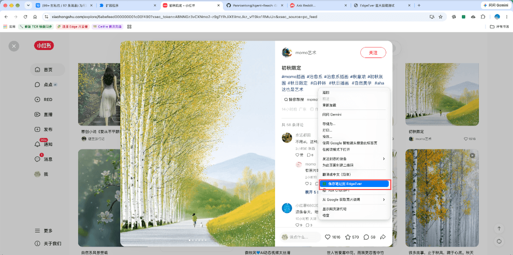 | 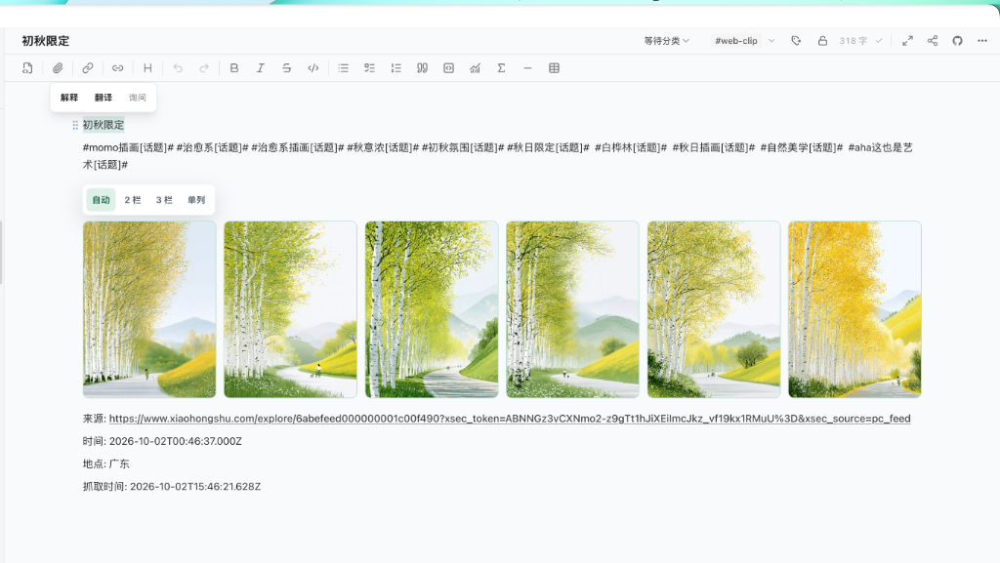 |

---

## 3. X (Twitter) 推文与引用一键剪藏

浏览 X (Twitter) 时，使用 EdgeEver Web Clipper 插件在任意推文上右键点击「保存推文到 EdgeEver」，即可一键完成结构化剪藏。

作者信息、正文、外链、引用推文（Quote Tweet）及附带的多张高清图片均能被精准提取并转为美观的多栏画廊排版，打上 `#web-clip` 标签永久沉淀为本地知识库卡片。

| 1. 推文右键「保存推文到 EdgeEver」 | 2. 自动生成包含引用与图集的推文笔记 |
| :---: | :---: |
| 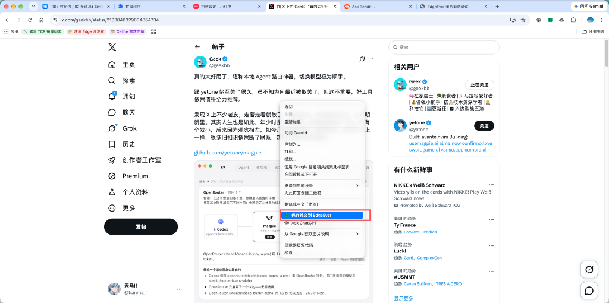 | 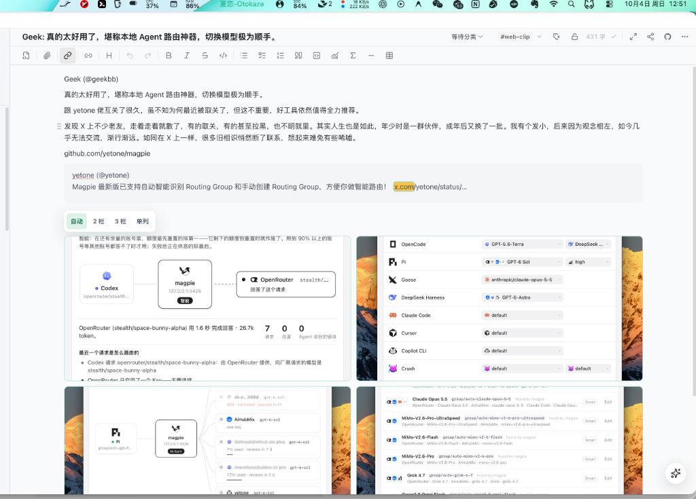 |

---

## 4. 知乎回答与文章一键精准剪藏

在知乎网页端阅读时，无需复制整页杂乱内容，只需在目标回答或专栏文章上右键点击「保存回答/文章到 EdgeEver」，即可一键完成单篇精准剪藏。

插件会自动解析对应的问题标题、回答者、完整排版正文、发布时间及原始链接，并以清晰的问答结构呈现，打上 `#web-clip` 标签归入知识库。

| 1. 回答右键「保存回答/文章到 EdgeEver」 | 2. 自动生成工整问答结构笔记 |
| :---: | :---: |
| 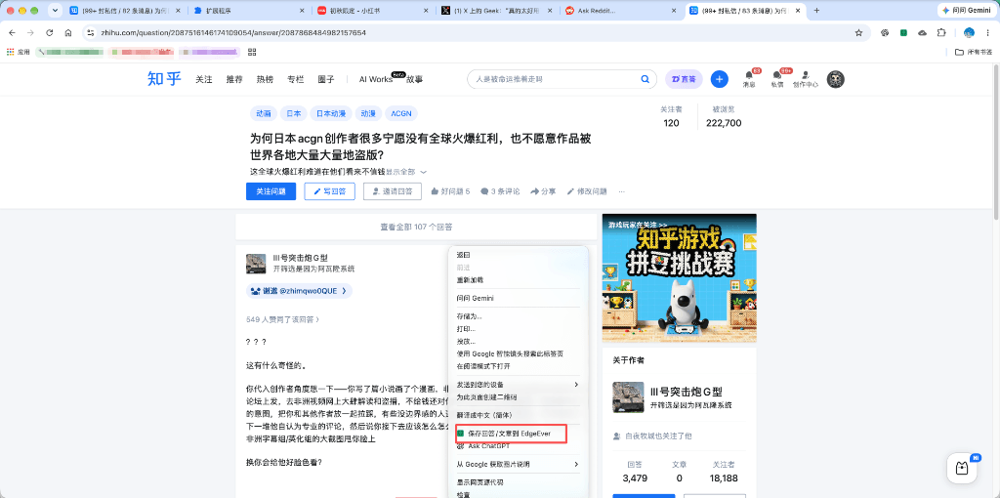 | 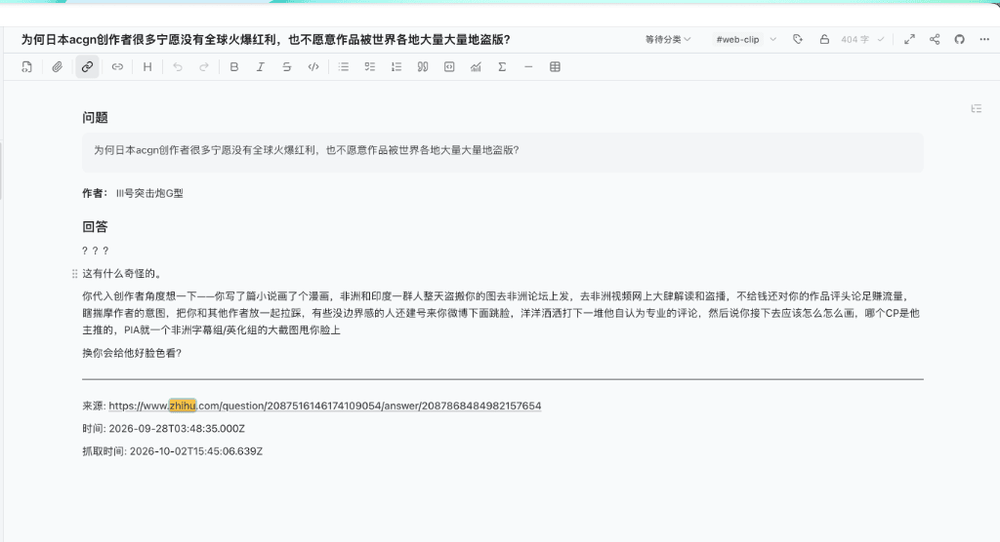 |

---

## 5. Reddit 讨论帖一键剪藏

在浏览 Reddit 社区时，使用 EdgeEver Web Clipper 插件在帖子标题或正文处右键点击「保存所选内容到 EdgeEver」，即可一键将该主题帖沉淀为独立笔记。

插件会自动提取帖子完整标题、所属版块（Subreddit，如 `r/AskReddit`）、发帖作者、发布时间、抓取时间及原始链接，并自动打上 `#web-clip` 标签方便日后复习与灵感回溯。

| 1. 帖子右键「保存所选内容到 EdgeEver」 | 2. 自动生成包含社区与作者元数据的帖子笔记 |
| :---: | :---: |
| 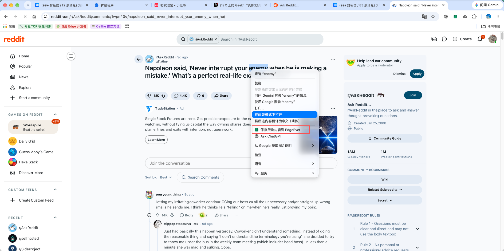 | 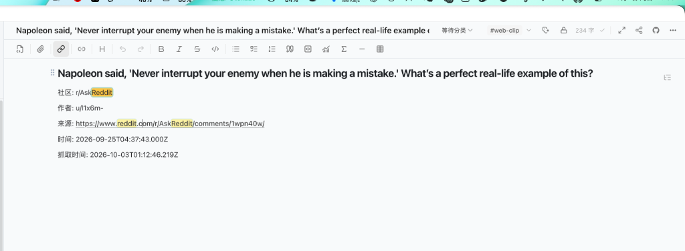 |

---

## 6. 一键复制笔记到微信公众号排版

在 EdgeEver 笔记列表或更多操作中点击「复制到公众号 / 博客」，即可将整篇笔记一键转换为内联样式的富文本。

直接粘贴到微信公众号后台图文编辑器中，表格、引述块、代码块、列表及字体排版均能完美保持，无需依赖任何第三方微信排版工具即可直接发布。

| 1. 笔记菜单点击「复制到公众号 / 博客」 | 2. 粘贴到公众号效果（表格与排版） | 3. 粘贴到公众号效果（代码/公式/列表） |
| :---: | :---: | :---: |
| 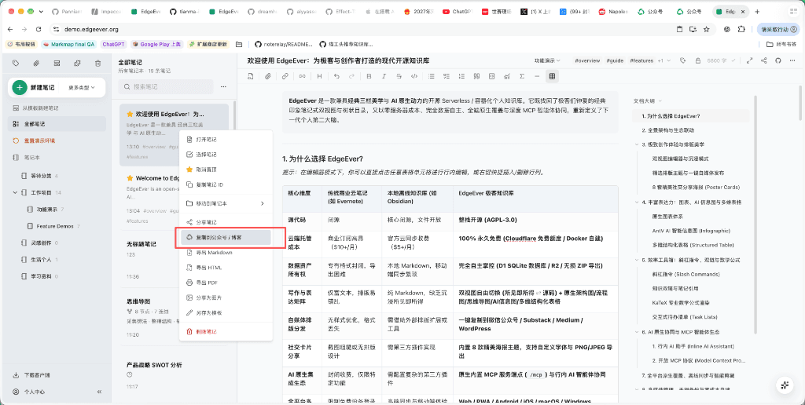 | 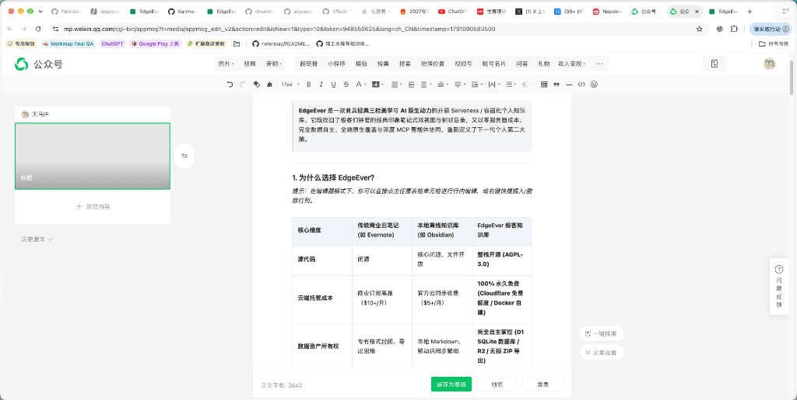 | 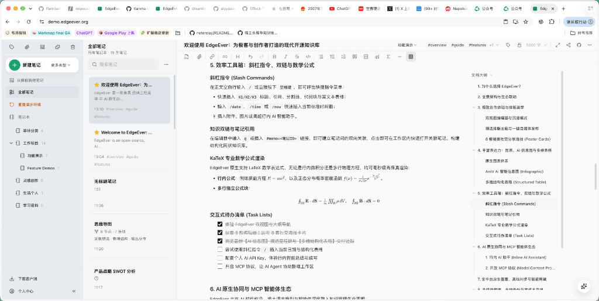 |

---

## 7. AI RSS 智能订阅日报与精美长图分享

EdgeEver 内置的 AI RSS 订阅能力可自动聚合行业前沿资讯，智能过滤冗余噪音，生成结构严谨、重点清晰的精炼日报笔记。

结合「分享为图片」功能，可自定义 8 款精美主题风格、衬线/等宽字体、卡片宽度及展示字段，一键导出高清长图或复制到剪贴板，优雅分享至社交媒体与社群。

| 1. 自动生成 RSS 日报并选择「分享为图片」 | 2. 自定义主题、字体与卡片版式 | 3. 导出的高清长图卡片效果 |
| :---: | :---: | :---: |
| 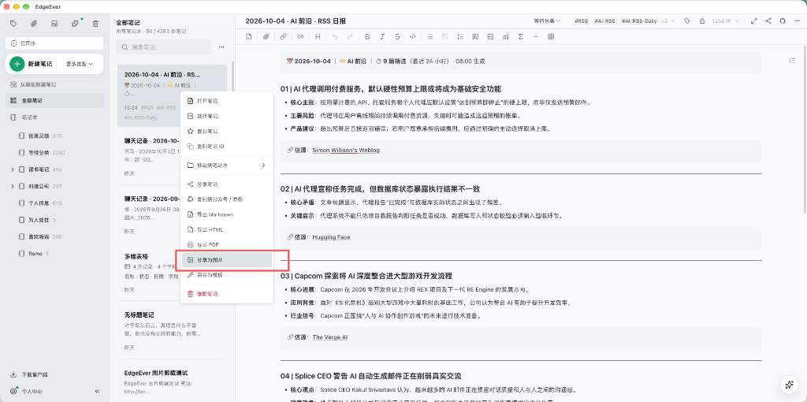 | 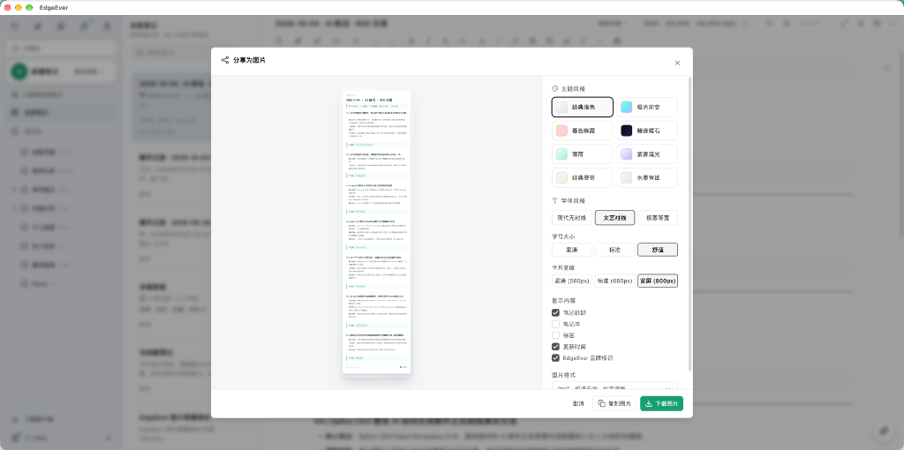 | 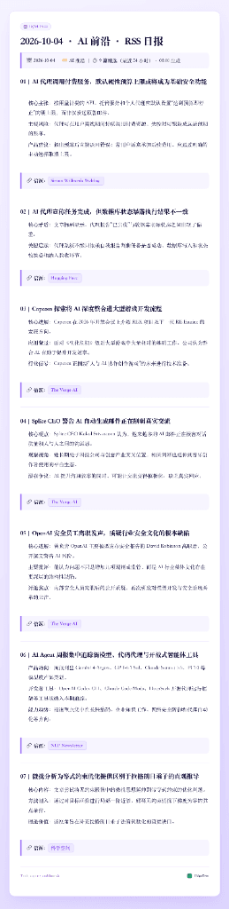 |

---

## 8. GitHub 开源仓库信息一键剪藏

在浏览器浏览 GitHub 仓库时，使用 EdgeEver Web Clipper 插件在任意区域右键点击「保存仓库信息到 EdgeEver」，即可一键将该项目元数据沉淀为结构化卡片。

插件会自动提取仓库名称（Owner/Repo）、项目简介（About）、官方主页、主要开发语言、开源许可证、话题标签（Topics）及仓库链接，统一打上 `#web-clip` 标签方便技术选型与工具库积累。

| 1. 仓库页面右键「保存仓库信息到 EdgeEver」 | 2. 自动生成包含技术标签与元数据的仓库卡片 |
| :---: | :---: |
| 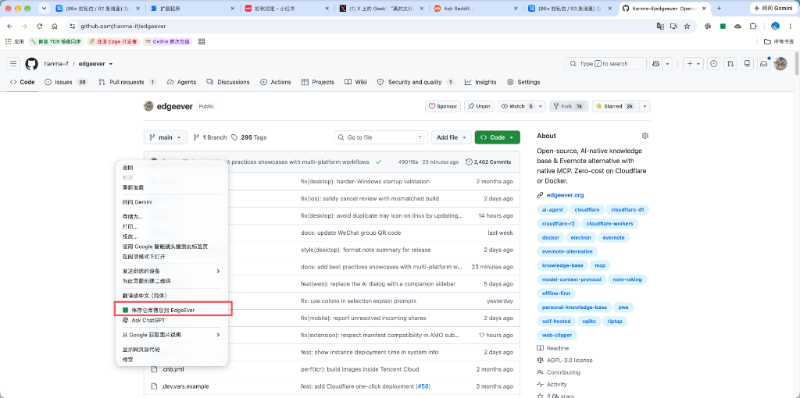 | 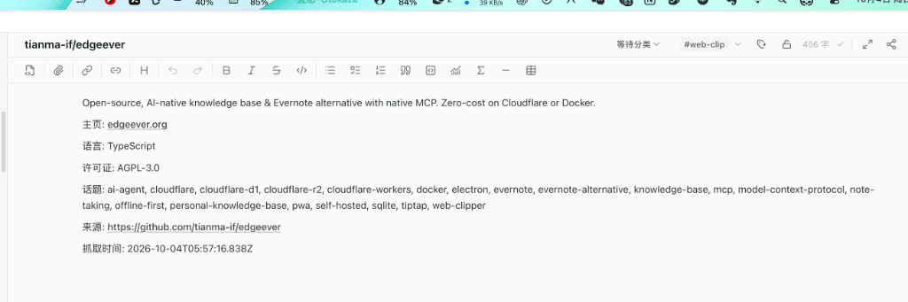 |

---

## 9. 移动端社媒图片一键转存笔记

在手机浏览各大社交媒体与内容平台（如 X / Twitter、Reddit、Instagram、Pixiv，以及知乎、B站、微博等）看到想要收藏的图片时，直接点击分享按钮即可直达笔记。

在系统分享面板中选择 **EdgeEver**，应用会自动拉起并静默上传原图，一键生成以「分享的图片」为标题的独立笔记，随时补充文字批注或打上标签分类。

| 1. 点击社媒 App 图片分享按钮 | 2. 系统分享面板选择 EdgeEver | 3. 自动生成笔记并极速上传原图 |
| :---: | :---: | :---: |
|  | 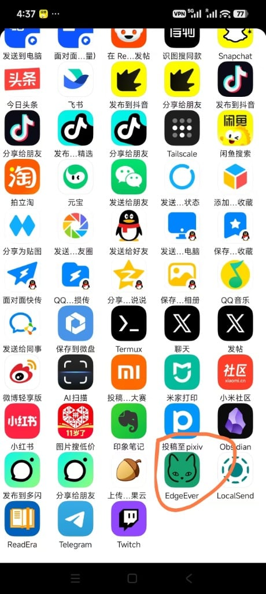 |  |

---

## 10. 手机端一键剪藏微信公众号文章

在手机微信中阅读公众号文章时，点击右上角菜单并选择「用 EdgeEver 打开」，即可一键完成全文章节剪藏。

应用会自动提取完整标题、正文结构与配图链接，去除页面多余噪点与排版干扰，转换为纯净优美的 Markdown 笔记，自动打上 `#web-clip` 与 `#wechat` 标签。

| 1. 文章分享菜单选择「用 EdgeEver 打开」 | 2. 自动拉起 App 提取标题与正文 | 3. 自动生成排版工整的纯净笔记 |
| :---: | :---: | :---: |
| 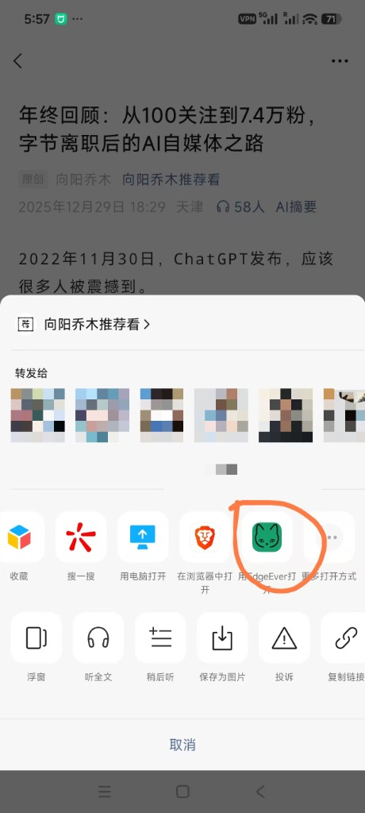 | 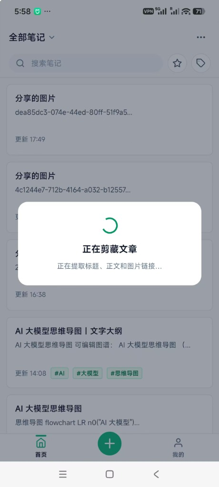 |  |

---

## 11. AI 对话一键生成思维导图、流程图与架构图

在 EdgeEver 右侧伴随式 AI 助手（或连接的本地 Agent）中，只需通过自然语言对话下达指令（如“帮我生成一个关于 AI 大模型的思维导图 / 流程图 / 架构图”），即可原地创建可交互、可编辑的可视化图表笔记。

生成的内容深度集成 EdgeEver 原生图谱引擎，支持节点自由增删拖拽、智能自动布局、中英双脑图、流程图条件分支与系统架构拓扑，无需安装外部绘图软件即可随心沉淀技术与业务全景。

| 1. 对话生成可交互思维导图 | 2. 对话生成标准化流程图 | 3. 对话生成高可用系统架构图 |
| :---: | :---: | :---: |
| 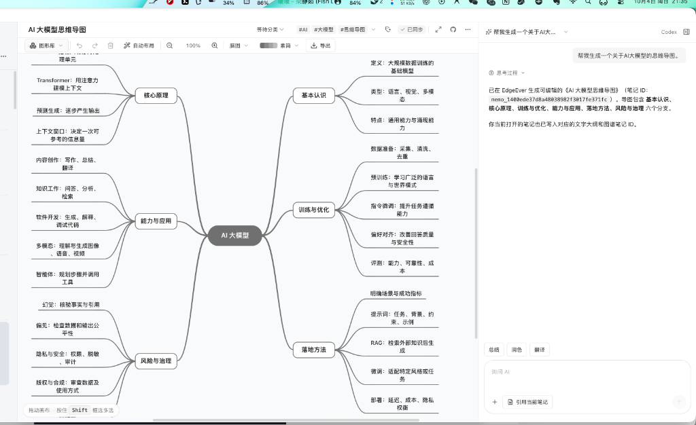 | 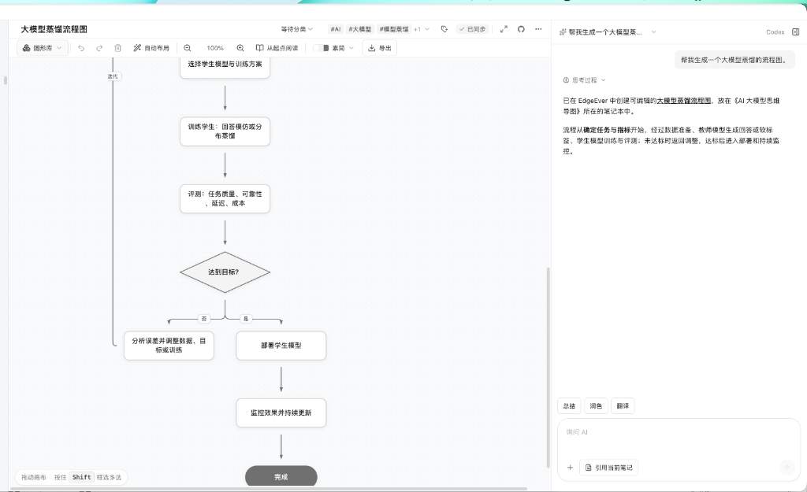 | 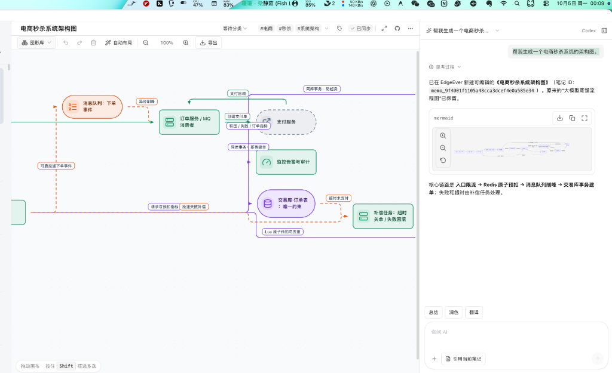 |

---

## 12. AI 智能生成专业信息图（时间线、对比图、架构图等）

利用 EdgeEver 内置的专业信息图库（涵盖顺序型时间线、对比型、列表型、四象限、层级型、关系型及图表型模板），可在右侧 AI 助手对话中直接描述想要呈现的内容与重点。

AI 会自动检索并校对关键时间与信息事实，一键原地生成具备专业级排版与配色美感的可视化信息图笔记，并支持自然语言多轮微调或一键导出为矢量图。

| 1. 丰富的信息图示例与模板库 | 2. AI 对话快速生成专业时间线信息图 |
| :---: | :---: |
| 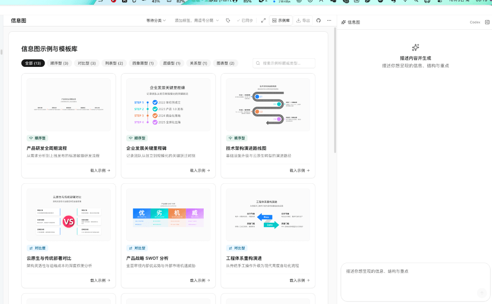 | 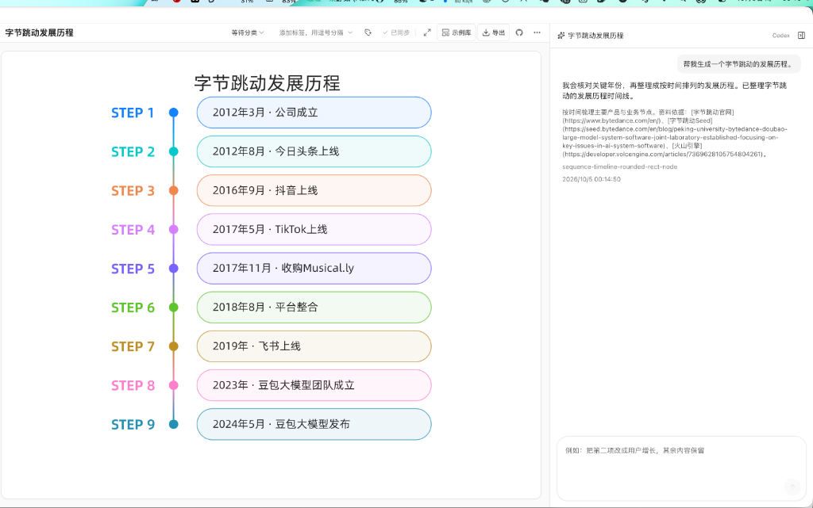 |

---

## 13. 借助右侧 AI 助手一句话生成多维表格

无需手动设计表头字段与选项，在右侧伴随式 AI 助手对话中发送一句话（例如“帮我生成一个自媒体选题库的多维表格”或“帮我生成一个员工信息登记表”），AI 即可自动分析业务场景并搭建完整的数据表结构。

系统不仅会自动推断并配置好单选标签、文本、日期、链接等多维字段类型，还会预置真实详实的示例数据行，支持表单收集、筛选排序与 CSV 导出，秒级开启结构化数据协作。

| 1. AI 一句话生成自媒体选题库多维表格 | 2. AI 一句话生成员工信息登记表 |
| :---: | :---: |
| 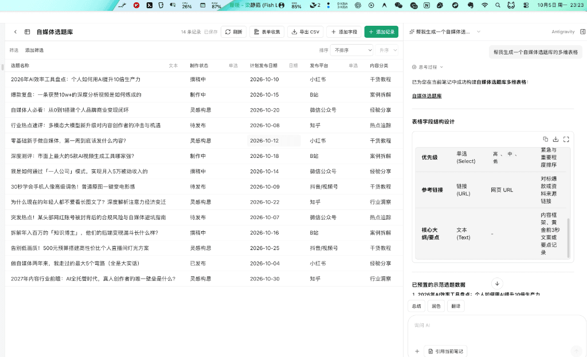 | 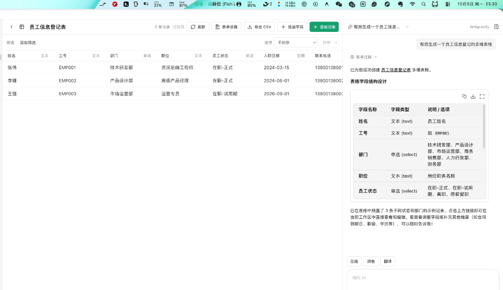 |

---

## 14. 多维表格一键生成在线公开收集表单

在 EdgeEver 多维表格顶部点击「表单收集」，即可一键将内部数据表转换为对外公开的在线数据填报页面。

外部填写者无需注册登录即可在手机或电脑浏览器中提交信息；表单字段、单选下拉项及日期选择器会自动与多维表格模型完全同步，用户提交的数据将实时沉淀入库，大幅简化信息统计、活动报名与员工登记等协同场景。

| 1. 多维表格顶部点击「表单收集」 | 2. 自动生成的对外公开填报表单页面 |
| :---: | :---: |
| 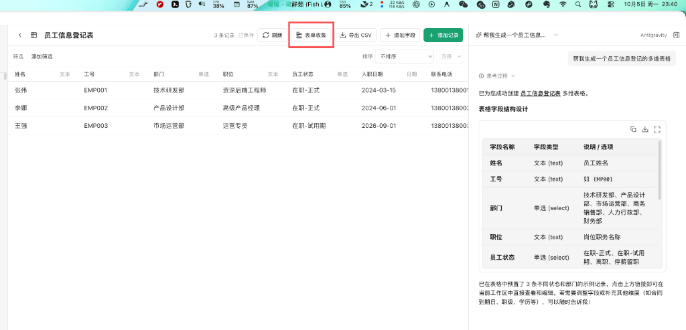 | 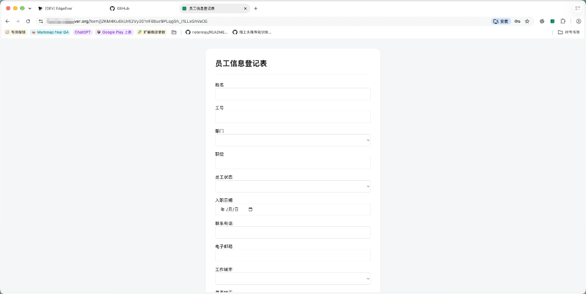 |

---
