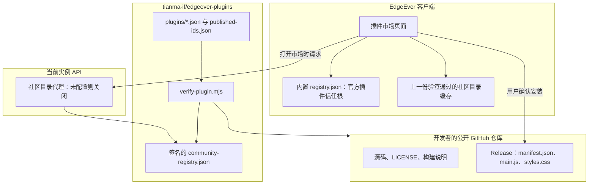

# EdgeEver 社区插件市场方案

本文档描述社区插件的收录、签名分发和客户端合并方式。官方插件的安装与自动更新仍以内置 `extensions/registry.json` 为信任根。社区目录只追加条目，不改写官方条目。

市场收录表示插件在收录时通过了公开源码、许可证和 Release 字节钉扎检查。它不表示 EdgeEver 保证插件安全。启用后的插件仍是页面内的可信代码，声明的权限只作展示，不拦截 API。用户直接粘贴 GitHub 仓库或 Manifest 地址安装的路径保持不变。

---

## 一、背景与目标

当前市场索引打包在 `apps/web/public/extensions/registry.json`，随 Web 部署和桌面安装包发布。现在只有 `org.edgeever.tasks` 与 `org.edgeever.plugins.ai-rss` 两条官方条目。新上架要等主工程发版，桌面用户还要再等应用更新。

目标：

- 社区插件上架不再跟随 EdgeEver 应用发版。
- 首次收录由维护者合并；同一仓库的后续版本在权限、许可证和所有权不变时由 CI 更新校验和。
- 客户端只把验签通过的社区目录叠加到内置官方列表上。
- 自建实例默认不请求社区目录。

明确不做的事：

- 不把远程索引当作官方插件的更新来源，也不允许它携带 `publisher: "edgeever"`。
- 不把“仓库里存在 `src/`”或对 `main.js` 的静态扫描描述成可复现构建或运行时沙箱。
- 不在应用启动同步里请求社区目录。
- 不扩大现有 GitHub 代理的读取范围来做许可证或源码树检查。

---

## 二、信任边界

官方条目今天会静默跟进。`resolveOfficialGithubEntry` 把内置 Registry 中的版本当作下限，并沿条目里的 `repositoryUrl` 拉取更新的 Release，然后用新的校验和自动安装。插件代码可以读取笔记并自行发出网络请求。因此远程文件只要能改官方条目的仓库地址，或给任意条目加上 `publisher: "edgeever"`，就等于取得官方插件的自动更新权。

社区目录遵守下面的规则。

| 规则 | 要求 |
| :--- | :--- |
| 官方条目的来源 | 只来自应用内置的 `extensions/registry.json`。启动时 `syncFromCatalogOnce` 继续只读这份文件来收集官方插件 ID。 |
| 社区条目的来源 | 只来自验签通过的社区 Registry。其中不得出现 `publisher`。 |
| 同一 ID | 内置条目保留，远程同 ID 条目丢弃。 |
| 保留命名空间 | `org.edgeever.*` 只允许出现在内置列表。社区 Registry 中的该前缀条目丢弃。 |
| 官方自动更新 | 只沿内置条目里的仓库地址进行。社区目录不能替换这个地址。 |
| 验签失败、超时、解析失败 | 丢弃这次远程结果。已展示的内置列表和上一份验签通过的社区缓存保持不变。 |
| 下架 | 使用签名 Registry 里的 `revocations` 记录。从列表中消失不是下架。客户端对已见过的下架 ID 只增不减，避免旧的签名文件把已下架插件重新放回来。 |
| 拉取时机 | 用户打开插件市场时拉取。打开后先显示内置列表和本地缓存，再在后台刷新。 |

下架记录能阻止新版本客户端安装、更新和官方自动更新，并提示已安装用户停用。尚未升级的客户端不认识这张表，官方插件的紧急下架仍要通过应用更新完成。

签名使用 Ed25519，对 Registry 原始字节签名。公钥打进客户端，同时接受当前密钥和上一把密钥，便于先发一版客户端再轮换。签名私钥只放在 `tianma-if/edgeever-plugins` 的发布环境，不放进 EdgeEver 主仓库。签名证明文件来自这把密钥；客户端仍按上表丢弃 `publisher`、官方 ID 和保留前缀，不因为签名就执行这些字段。

---

## 三、总体架构

社区元数据放在独立仓库 `tianma-if/edgeever-plugins`。官方插件继续在主仓库维护，不写入这个仓库。



安装字节仍从开发者的 GitHub Release 下载，并由实例上现有的 `/api/v1/plugins/github/...` 代理。客户端对照社区条目里的 SHA-256 再验一次。社区目录不托管 `main.js`。

仓库布局：

```text
tianma-if/edgeever-plugins
├── .github/workflows/
│   ├── verify-submission.yml      # PR 上运行与本地相同的校验脚本
│   ├── publish-registry.yml       # 仅 main 推送后聚合、签名、发布
│   └── refresh-releases.yml       # 已收录仓库的新 Release：权限未扩大则自动更新校验和
├── plugins/
│   └── com.example.readwise.json  # 一个插件一个文件，下架后文件保留
├── published-ids.json             # 曾经发布过的 ID，只增不减
├── scripts/
│   ├── verify-plugin.mjs
│   └── compile-registry.mjs
├── schemas/
│   └── plugin-submission.schema.json
└── README.md
```

`compile-registry.mjs` 读取 `plugins/*.json`。活动条目进入 `entries`，`status: "revoked"` 的条目进入 `revocations`，并从 `entries` 移除。`published-ids.json` 里的每个 ID 必须要么仍是活动条目，要么有下架记录；删除插件文件而不能通过发布。社区条目的 `distribution.type` 固定为 `github`。只提供 Manifest URL 的插件仍可让用户直接安装，不进入社区目录。

发布产物是一对文件：`community-registry.json` 与 `community-registry.json.sig`。它们放在 EdgeEver 自己的主机名上，缓存时间短（`max-age=60`）。不使用 jsDelivr 这类无法由本仓库立即失效的公共缓存。

---

## 四、收录与更新

校验脚本与 CI 使用同一份 `verify-plugin.mjs`。脚本通过 `@edgeever/plugin-api` 解析 Manifest，并沿用客户端已有的体积上限：`manifest.json` 256 KiB，`main.js` 5 MiB，`styles.css` 1 MiB。

### 首次收录

开发者对 `tianma-if/edgeever-plugins` 提交只新增 `plugins/<id>.json` 的 PR。CI 按文件中的单一 `repositoryUrl` 重新拉取，不采信 PR 描述里的其他地址。

提交人必须对源仓库有写权限。CI 用 GitHub API 核对此权限；权限无法通过 API 确认时，源仓库默认分支的待收录 Commit 上必须有 `.edgeever/marketplace-claim`，内容为该 PR 的完整 URL。二者都不满足则拒绝合并。这样不能用他人的公开仓库抢占插件 ID。

维护者合并前看源码、构建说明和 Release 是否对得上。CI 通过只说明机械检查通过。

| 检查 | 通过条件 | 这项检查不能证明的事 |
| :--- | :--- | :--- |
| 仓库可见性 | 匿名访问仓库元数据返回 200。404 或其他状态一律拒绝。不为这项检查发放可读私有仓库的令牌。 | |
| 许可证 | 仓库根目录有许可证文件，且能识别为 OSI 认可的 SPDX 标识。GitHub License API 返回 `NOASSERTION` 时，改用本地许可证文本识别。依赖的许可证兼容由作者负责，并在首次人工审核时看第三方声明。 | |
| 可读源码 | 插件仓库包含人类可读源码和构建说明，不能只有打包后的 `main.js`。主题没有 `main.js`，改为检查完整主题 Manifest 和许可证。 | 不证明 Release 里的 `main.js` 由该 Commit 编译而来。 |
| 版本追溯 | Release Tag 指向一个不可变 Commit。记录 40 位 Commit SHA，并计算 `manifest.json`、`main.js`（主题可没有）和可选 `styles.css` 的 SHA-256。 | 这是字节钉扎，不是可复现构建。 |
| 清单一致性 | Manifest 的 ID、版本、`apiVersion` 与条目一致。插件 ID 匹配 `^[a-z0-9]+(?:[._-][a-z0-9]+)+$`，且不使用 `org.edgeever.*`。条目不含 `publisher`。 | |
| 权限快照 | 把该版本 Manifest 的 `permissions` 与 `networkHosts` 写入条目的 `admitted` 字段，供以后的自动更新比较。 | `networkHosts` 不是运行时隔离边界。 |
| 静态扫描 | 对插件 `main.js` 标记 `eval`、`new Function` 和远程脚本加载，结果写进 PR 供审核者查看。主题跳过此项。 | 打包产物会误报，字符串拼接会漏报。此项不单独阻断合并。 |

### 已收录版本的更新

`refresh-releases.yml` 发现已收录仓库出现新 Release 后，由机器人提交只改版本、Commit SHA 和校验和的 PR。同时满足以下条件时自动合并：

- 仓库所有者和仓库名没变；
- 插件 ID 没变；
- 许可证 SPDX 标识没变；
- 新 Manifest 的 `permissions` 与 `networkHosts` 没有超出已记录的 `admitted` 快照；
- `apiVersion` 仍是当前客户端接受的版本；
- 第四节的机械检查通过。

所有权变化、许可证变化、权限或 `networkHosts` 扩大、`apiVersion` 变化，都留下人工审核。机器人不能修改 `admitted` 快照。

### 下架

维护者把对应文件的 `status` 改为 `revoked`，并写明 `reason` 与 `revokedAt`。文件和 `published-ids.json` 中的 ID 都保留。用户把仓库改为私有、删掉许可证、转移仓库所有权，或插件行为带来安全与隐私风险时，按上架政策下架。

---

## 五、Registry 格式

`registryVersion` 保持 `"1"`。现有 `parseMarketplaceRegistry` 会丢弃不认识的字段，旧客户端遇到新字段仍能解析内置列表。社区字段先随客户端发版，再开始被市场界面使用。

社区 Registry 在现有字段之外增加可选信息：

```json
{
  "registryVersion": "1",
  "updatedAt": "2026-10-05T00:00:00.000Z",
  "entries": [
    {
      "id": "com.example.readwise",
      "name": "Readwise",
      "description": "Imports Readwise highlights into notes.",
      "author": "Example",
      "category": "Import",
      "repositoryUrl": "https://github.com/example/readwise",
      "distribution": {
        "type": "github",
        "repositoryUrl": "https://github.com/example/readwise"
      },
      "verification": {
        "version": "1.2.0",
        "checksums": {
          "manifestJson": "<sha256>",
          "mainJs": "<sha256>"
        }
      },
      "licenseSpdx": "MIT",
      "sourceRevision": "<40-char commit sha>",
      "admitted": {
        "permissions": ["notes:write"],
        "networkHosts": ["readwise.io"]
      }
    }
  ],
  "revocations": [
    {
      "id": "com.example.old",
      "reason": "仓库已转为私有",
      "revokedAt": "2026-10-05T00:00:00.000Z"
    }
  ]
}
```

社区条目没有 `publisher`。`licenseSpdx`、`sourceRevision`、`admitted` 和文件顶层的 `revocations` 需要新客户端才生效。校验和字段仍只允许 `manifestJson`、`mainJs`、`stylesCss`。

---

## 六、客户端行为

启动同步不请求社区目录，官方插件 ID 仍只从内置 Registry 读取。避免每次启动等待外网，也避免请求失败时把官方插件当成社区插件。

用户打开插件市场时：

1. 立即显示内置官方条目，以及 IndexedDB 中上一份验签通过的社区目录。
2. 若当前实例配置了社区目录，向实例请求最新文件和签名。
3. 用内置公钥验签。失败则保持第 1 步的界面。
4. 合并时丢弃带 `publisher` 的条目、`org.edgeever.*` 条目，以及与内置条目冲突的 ID。
5. 按本机插件 `apiVersion` 过滤，装不上的条目不展示。
6. 把新的下架 ID 并入本地只增集合。命中下架的条目不展示；已经安装的，在插件页提示停用。官方自动更新在执行前跳过这些 ID。
7. 缓存验签通过的原始字节、签名和 `updatedAt`。`updatedAt` 更旧的签名文件不能覆盖缓存。

社区插件的更新沿用现有规则：Registry 中的版本更高时，卡片显示可更新，用户点击后安装，并在声明能力变化时列出变化。社区插件不静默更新。市场里的社区插件仍走现有的社区插件信任确认。界面展示许可证和“社区”标记。复制保持上架政策中的含义：已验证是收录检查，不是安全保证。

自建实例默认不设置社区目录地址，市场只显示内置官方插件。官方部署通过实例环境变量 `EDGE_EVER_COMMUNITY_REGISTRY_URL` 打开该功能。客户端不写死外部 CDN 地址。

实例新增需登录的 `GET /api/v1/plugins/community-registry`。未配置环境变量时返回 404。配置后由实例去取 Registry 与签名并原样返回，客户端自己验签。这个接口不接受调用者指定的任意 URL，也不读取许可证或源码树。

---

## 七、提交入口

端内向导放在客户端合并与验签完成之后做。向导只使用现有 GitHub 代理已经提供的能力：

- 仓库地址能否解析出公开仓库的 Manifest；
- Manifest 的 ID、版本和 `apiVersion` 是否可被当前客户端接受；
- 对应 Release 是否包含要求的资产。

向导不检查许可证和源码目录。完整检查由开发者在本地运行 `verify-plugin.mjs`，PR 上再跑同一脚本。预检通过后，打开带仓库地址和插件 ID 的 Issue 模板；这两个字段必须与 PR 中的 `plugins/<id>.json` 一致，Issue 正文不作为收录依据。

设置页可以先放开发文档和仓库 README 的链接。向导上线前，提交路径就是按 README 开 PR。

---

## 八、实施顺序

1. **独立仓库与校验脚本。** 建立 `tianma-if/edgeever-plugins`，实现校验、聚合、签名发布和已收录版本的自动更新。此阶段不改 EdgeEver 客户端，官方插件仍随主工程发布。
2. **客户端认识新字段并验签。** 扩展 `parseMarketplaceRegistry` 的可选字段，但保持 `registryVersion` 为 `"1"`。实现打开市场时的拉取、验签、合并、下架记忆和 `apiVersion` 过滤。实例代理默认为关闭。
3. **市场展示。** 社区条目显示许可证和社区标记，提供手动刷新。信任确认文案继续把它们视为社区插件。
4. **端内预检向导。** 只复用现有 Manifest 与 Release 读取。不新增源码树或许可证代理。

---

## 九、风险与回滚

第一阶段没有客户端行为变化。回滚就是停止合并该仓库的 PR。

社区目录或签名私钥被滥用时，攻击者可以列出一个新的社区插件，或替换已收录插件的钉扎字节。用户仍需自行安装社区插件，官方插件的仓库地址和自动更新不会被这份文件改道。处理方式是用尚未泄露的密钥发布下架记录；若当前私钥已经不可信，先发一版只信任新公钥、并忽略社区目录的客户端。已经安装的副本会继续运行，直到用户停用。

自建实例不配置 `EDGE_EVER_COMMUNITY_REGISTRY_URL` 时不会访问社区目录。官方实例只在用户打开插件市场、并且代理被调用时才取这份文件。
