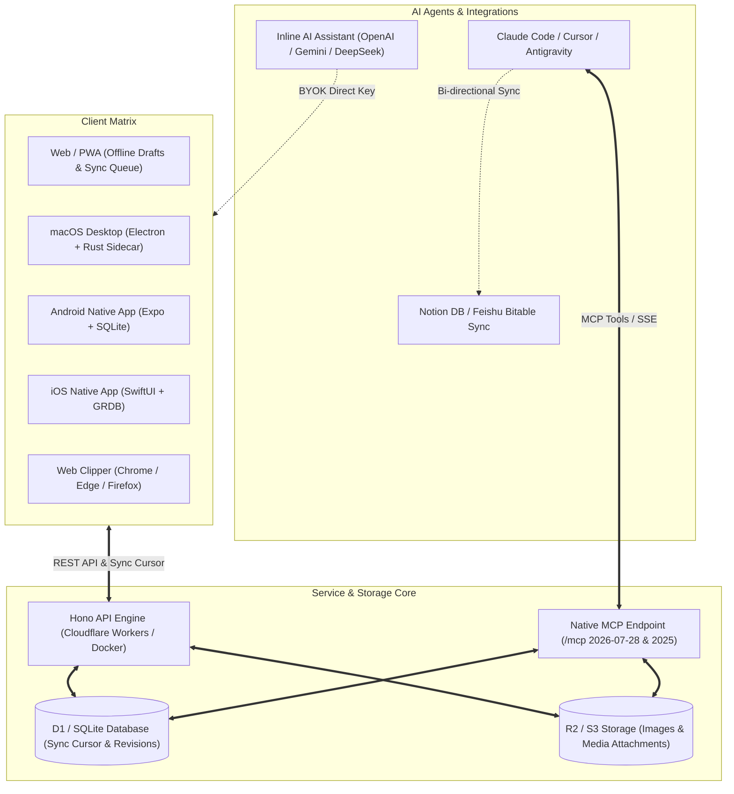
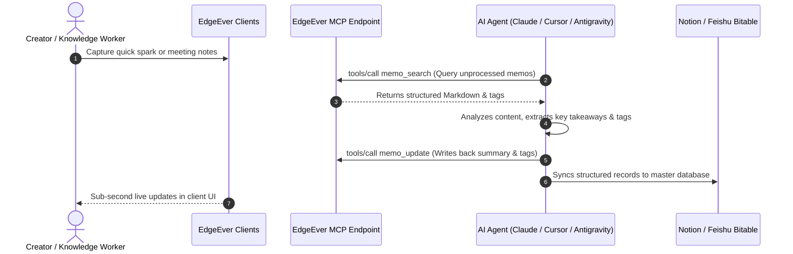

> **EdgeEver** is an open-source, AI-native, and portable serverless/containerized personal knowledge base that revives the beloved **Evernote-style three-pane layout**. Designed for geeks and content creators, it combines 100% free serverless hosting, absolute data ownership, native cross-platform clients, and seamless AI Agent (MCP) synergy to redefine your digital second brain.

---

## ⚡ 1. Why Choose EdgeEver?

*Tip: In editor mode, click any table cell to edit text directly, or right-click to insert/delete rows and columns.*

| Dimension | Traditional Cloud Notes (e.g. Evernote) | Local Offline Notes (e.g. Obsidian) | EdgeEver Geek Knowledge Base |
| :--- | :--- | :--- | :--- |
| **Source Code** | Closed source | Closed-source core, open files | **Full-stack open source (AGPL-3.0)** |
| **Hosting Cost** | Costly commercial subscriptions ($10+/mo) | Official cloud sync subscription ($5+/mo) | **100% Free Forever (Cloudflare Free Tier / Docker Self-Hosted)** |
| **Data Ownership** | Proprietary lock-in, hard to export | Local Markdown, cumbersome mobile sync | **Full Ownership (D1 SQLite, R2 Storage, Lossless ZIP Archives)** |
| **Editing Experience** | Rich text only, fragile formatting | Plain Markdown, lacks WYSIWYG flow | **Seamless Dual-View (WYSIWYG Rich Text ⇄ Markdown Source)** |
| **Publishing Ready** | No typography styling, loses format | Requires 3rd-party plugins or scripts | **One-Click Rich Copy for WeChat, Substack, Medium & WordPress** |
| **Social Poster Cards** | Basic screenshots without styling | Requires external tools or plugins | **8 Built-in Exquisite Poster Themes with Typography Options & PNG/JPEG Export** |
| **Native AI Ecosystem** | Paywalled, limited features | Heavy plugin setup required | **Native MCP Server (`/mcp`) & Inline AI Agent Synergy** |
| **Cross-Platform Matrix** | Restricts active free devices | Complex setup across platforms | **Web / PWA / Android / iOS / macOS / Windows (Coming Soon)** |

---

## 🏗️ 2. Architectural Overview & Ecosystem

The Mermaid diagram below demonstrates how EdgeEver connects cross-platform clients, zero-cost cloud infrastructure, and AI Agents into a cohesive workflow:



---

## 🎨 3. Immersive Writing & Typography Aesthetics

EdgeEver is engineered to provide a distraction-free, elegant writing experience:

### 🖥️ Dual-View Editor & Focus Modes
- **Seamless Dual-View**: Click the `</>` button in the top-right corner (or use shortcuts) to instantly toggle between **WYSIWYG Rich Text** and **Markdown Source Code** with 100% fidelity.
- **Collapsible Outline Navigation**: Automatically indexes `H1-H3` heading hierarchies with smooth jump scrolling, keeping lengthy documents organized.
- **Zen Focus Mode**: Press `Cmd/Ctrl + Shift + F` to hide sidebars and distractions, immersing yourself in pure writing flow.
- **Reading Protection Mode**: When reading or reviewing notes, press `Cmd/Ctrl + E` to toggle read-only protection, locking the editor to prevent accidental edits while browsing; press it again to seamlessly resume editing.

### 🎭 Curated Typography Themes & Publishing Export
- **Preset Editor Themes**: Switch effortlessly between `WeChat Classic Green`, `Modern Mint`, `Minimal Emerald`, `Outline Emerald`, and more.
- **One-Click Publishing Export**: Built for publishers and bloggers. Click the **WeChat Icon** in the top bar to format your note with inline CSS. Paste directly into WeChat Official Account editor, Substack, Medium, or WordPress while preserving layout and syntax highlighting.

### 🖼️ 8 Exquisite Social Poster Themes
Click **"Share as Card"** in the top-right menu to turn any note into an eye-catching poster card:
- **8 Themes**: `Slate`, `Aurora`, `Sunset`, `Midnight`, `Mint`, `Notepad` (skeuomorphic paper), `Xuan` (rice paper & Chinese ink), `Lavender`.
- **Customizable Typography**: Switch between Sans, Serif (Songti/Ming), and Monospace fonts, select compact, standard, or wide card widths, and export as high-resolution PNG or JPEG.

---

## ⌨️ 4. Power Productivity Toolbox: Slash Commands, Backlinks & Math

### 🪄 Slash Commands
Type `/` or press `Space` on an empty line to invoke the command menu:
- Insert `H1/H2/H3` headings, quotes, horizontal rules, code blocks, and rich tables;
- Use `/date`, `/time`, or `/now` to insert current timestamps instantly;
- Attach files, insert images, or summon the inline AI assistant.

### 🔗 Bi-directional Note Links & Backlinks
Type `@` or insert `#memo=<memoId>` links to establish bi-directional references across your knowledge base, building an interconnected web of thoughts.

### 📐 KaTeX Professional LaTeX Mathematics
Native support for KaTeX renders complex mathematical equations in milliseconds:

- **Inline Math**: For instance, Einstein's mass-energy equivalence $E = mc^2$ or the Gaussian probability density function $f(x) = \frac{1}{\sigma \sqrt{2\pi}} e^{-\frac{(x-\mu)^2}{2\sigma^2}}$.
- **Display Block Math**:
$$
\oint_{\partial \Omega} \mathbf{E} \cdot d\mathbf{S} = \frac{1}{\varepsilon_0} \iiint_{\Omega} \rho \, dV, \quad \oint_{\partial \Omega} \mathbf{B} \cdot d\mathbf{S} = 0
$$

### ✅ Interactive Task Lists
- [x] Explore EdgeEver's dual-view editing and outline navigation
- [x] Experiment with 8 editor themes and 8 social poster card styles
- [ ] Try typing `/` on an empty line to insert current timestamp and tables
- [ ] Connect your AI API Key to experience inline summarization and continuation
- [ ] Connect AI Agents via MCP to automate note categorization

---

## 🤖 5. Native AI Agent Synergy & MCP Protocol

EdgeEver is architected for the agentic AI era, weaving LLMs directly into the knowledge management lifecycle:



### 1️⃣ Inline AI Assistant
Press the **`Space` bar** in an empty block, type **`/ai`**, use the **`/`** slash command menu, or select text and click the **AI button** on the floating toolbar to instantly summon the AI writing assistant:
- **Summarization & Action Items**: Condense documents into key takeaways, conclusions, and actionable todos;
- **Format-Preserving Translation**: Translate accurately into multiple languages while strictly preserving Markdown, math equations, links, and code blocks;
- **Rewriting & Style Transformation**: Improve phrasing, fix spelling/grammar, adapt to social media styles (e.g. Xiaohongshu / Twitter), or continue writing seamlessly;
- **BYOK Direct Key (Bring Your Own Key)**: Direct client-side connection with OpenAI, Anthropic Claude, Google Gemini, DeepSeek, and OpenAI-compatible relays with zero third-party data transit.

### 2️⃣ Model Context Protocol (MCP) Integration
Generate an API token in **Settings → MCP Settings** to connect EdgeEver directly with Claude Code, Cursor, Antigravity, OpenClaw, and other agent platforms:
- **Direct Reading & Writing**: Connect via the `/mcp` endpoint (supports stateless `2026-07-28` protocol and handshake-based 2025 specs);
- **Automated Workflows**: Let AI Agents read, organize, summarize, tag, and synchronize notes with Notion databases and Feishu Bitable.

---

## 📱 6. Multi-Platform Ecosystem, Offline Sync & Smart Clipping

- **Cross-Platform Native Apps**:
  - **Web / PWA**: Full-featured in modern browsers with offline installation support;
  - **Android Native App**: Built with Expo & SQLite, available on Google Play and GitHub Releases;
  - **iOS Native App**: Native Swift / SwiftUI with GRDB local mirror, available on the App Store (requires a non-mainland China Apple ID);
  - **macOS Desktop App**: Electron + Rust Sidecar for Apple Silicon & Intel Mac with silent background updates;
  - **Windows Desktop App**: Development is complete, coming soon.
- **Browser Web Clipper**: Available on Chrome, Edge, and Firefox extension stores to extract clean, ad-free Markdown articles in one click.
- **Mobile WeChat Article Clipper**: Share any WeChat article to EdgeEver on your phone to automatically extract and format it as an editable note.
- **Offline Drafts & Sync Queue**: Keep writing seamlessly without network connectivity; changes are queued locally and automatically synced once reconnected.

---

## 📦 7. Rich Media, Lossless Portability & Zero-Cost Hosting

### 🖼️ Smart Client-Side Image Compression
When pasting or dragging images into notes, EdgeEver compresses them to WebP locally in your browser before upload, **reducing file size by 50% - 90%** while preserving visual fidelity.


### 📎 Universal File Attachments
Embed PDFs, spreadsheets, archives, and multimedia files directly in notes for preview or download:
- [📄 Product brief PDF: edgeever-product-brief.pdf](/api/v1/resources/res_demo_product_brief_pdf/blob)
- [📊 Feature matrix CSV: feature-matrix.csv](/api/v1/resources/res_demo_feature_matrix_csv/blob)
- [📦 Sample attachment archive: edgeever-attachment-demo.zip](/api/v1/resources/res_demo_attachment_bundle_zip/blob)

### 🚀 Zero-Cost Serverless & Docker Self-Hosting
1. **Cloudflare Serverless (Recommended, 100% Free Forever)**: Runs entirely within Cloudflare's free tier (Workers + D1 SQLite + R2 Storage). No server bills, no VPS maintenance.
2. **Docker One-Command Deployment (VPS / NAS / Home Server)**:
   ```sh
   # Official GHCR image
   curl -fsSL https://edgeever.org/install.sh | bash
   ```
   Configures Docker Compose and automated daily background updates with one command. Some network environments in mainland China may require an available network proxy or a trusted registry mirror to access GHCR.

### 💾 Complete Data Freedom: Lossless ZIP Portability
Export your entire library at any time from **Profile → Import and export**. The archive contains pure Markdown files with standard YAML Front Matter, relative media paths, and full revision histories—compatible with Obsidian, VS Code, and any plain text editor.

---

> 💡 **Quick Exploration Tips**:
> 1. Click **`</>`** in the top right to try seamless dual-view toggling;
> 2. Press **`Cmd/Ctrl + E`** to test reading protection mode against accidental edits;
> 3. Press **`Cmd/Ctrl + O`** to summon the Quick Switcher;
> 4. Click the **WeChat Icon** to copy formatted rich text ready for publishing;
> 5. Click **"Share as Card"** to export a stunning social poster card;
> 6. Click **"Reset Demo Data"** in settings or the sidebar anytime to restore the demo workspace.
