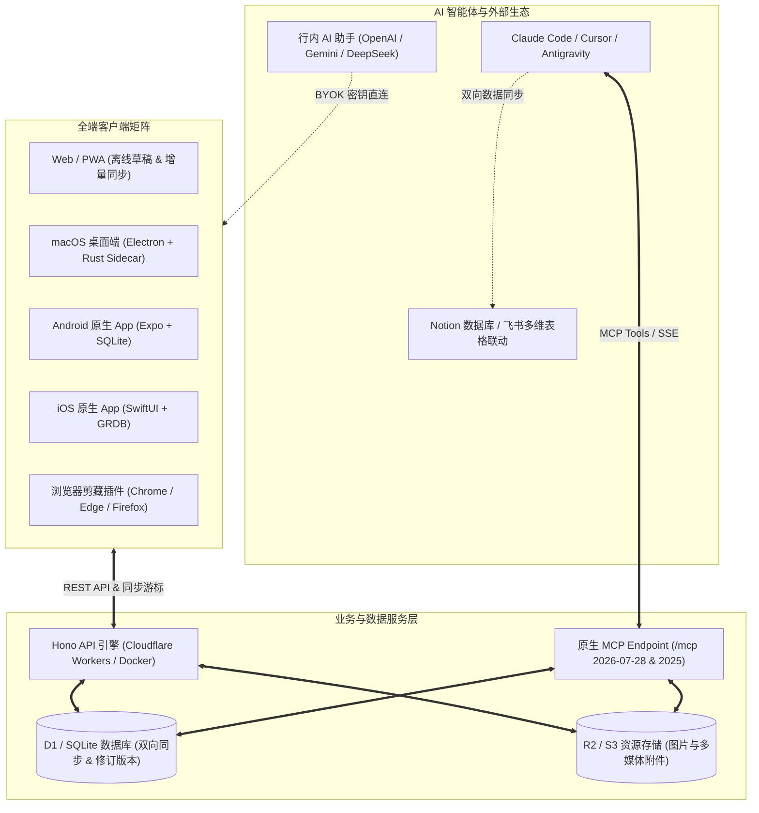
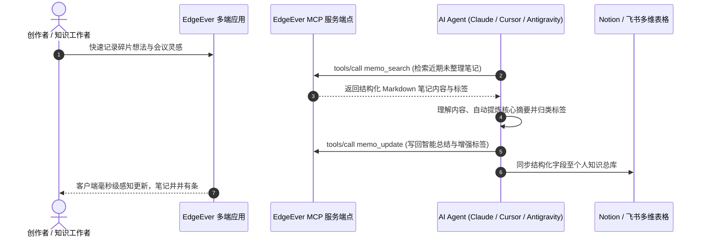

> **EdgeEver** 是一款兼具**经典三栏美学**与 **AI 原生动力**的开源 Serverless / 容器化个人知识库。它既找回了极客们钟爱的经典印象笔记式双视图与树状目录，又以零服务器成本、完全数据自主、全端原生覆盖与深度 MCP 智能体协同，重新定义了下一代个人第二大脑。

---

## ⚡ 1. 为什么选择 EdgeEver？

*提示：在编辑器模式下，你可以直接点击任意表格单元格进行行内编辑，或右键快捷插入/删除行列。*

| 核心维度 | 传统商业云笔记 (如 Evernote) | 本地离线知识库 (如 Obsidian) | EdgeEver 极客知识库 |
| :--- | :--- | :--- | :--- |
| **源代码** | 闭源 | 核心闭源，文件开放 | **整栈开源 (AGPL-3.0)** |
| **云端托管成本** | 商业订阅高昂（$10+/月） | 官方云同步收费（$5+/月） | **100% 永久免费 (Cloudflare 免费额度 / Docker 自建)** |
| **数据资产所有权** | 专有格式封闭，导出困难 | 本地 Markdown，移动端同步繁琐 | **完全自主掌控 (D1 SQLite 数据库 / R2 / 无损 ZIP 导出)** |
| **写作与编辑体验** | 仅富文本，排版易错乱 | 纯 Markdown，缺乏沉浸所见即所得 | **双视图自由切换 (所见即所得富文本 ⇄ Markdown 源码)** |
| **自媒体排版分发** | 无样式优化，格式丢失 | 需借助外部排版扩展或工具 | **一键复制到微信公众号 / Substack / Medium / WordPress** |
| **社交卡片分享** | 截图粗糙或无排版设计 | 需第三方插件实现 | **内置 8 款精美海报主题，支持自定义字体与 PNG/JPEG 导出** |
| **AI 原生集成生态** | 封闭收费，仅限特定功能 | 需配置复杂的第三方插件 | **原生内置 MCP 服务端点 (`/mcp`) 与行内 AI 智能体协同** |
| **全平台多端覆盖** | 限制免费设备登录数量 | 多端同步与移动端体验门槛高 | **Web / PWA / Android / iOS / macOS / Windows (即将推出)** |

---

## 🏗️ 2. 全景架构与生态联动

通过下面的 Mermaid 架构图，你可以清晰了解 EdgeEver 如何将多端客户端、零成本云基础设施与 AI Agent 紧密串联：



---

## 🎨 3. 极致创作体验与排版美学

EdgeEver 将高效与优雅融入每一处交互细节，助你专注于思考与表达：

### 🖥️ 双视图编辑器与沉浸模式
- **自由切换视图**：点击右上角 `</>` 按钮或使用快捷键，可在**所见即所得富文本**与 **Markdown 源码**间无缝切换，实时双向保真。
- **左侧可折叠大纲**：自动解析文档 `H1-H3` 标题层级，支持点击平滑滚动跳转，助你轻松把控万字长文。
- **Zen 专注模式**：按下 `Cmd/Ctrl + Shift + F`，隐藏所有侧边栏与干扰元素，进入纯粹写作心流。
- **阅读保护模式 (Reading Protection)**：日常翻阅或查阅笔记时，按下 `Cmd/Ctrl + E` 即可一键开启只读保护，锁定当前编辑状态，避免沉浸阅读时误触键盘或意外改动笔记内容；再次按下即可随手切回编辑。

### 🎭 精选排版主题与一键自媒体发布
- **内置排版主题**：支持一键切换 `WeChat Classic Green (微信经典绿)`、`Modern Mint (薄荷青)`、`Minimal Emerald (极简祖母绿)`、`Outline Emerald (大纲祖母绿)` 等风格。
- **一键排版复制**：专为内容创作者设计。点击顶部工具栏的**微信公众号图标**，系统自动将当前笔记转为内联 CSS 样式的优雅富文本，直接粘贴至微信公众号后台、Substack 或 WordPress，排版与代码高亮完美保真。

### 🖼️ 8 套精美社交分享海报 (Poster Cards)
点击右上角“分享为卡片”，即可将任意笔记或片段渲染为高清分享海报，支持：
- **8 大主题风格**：`Slate (岩灰)`、`Aurora (极光青)`、`Sunset (落日暖橙)`、`Midnight (暗夜极客)`、`Mint (清爽薄荷)`、`Notepad (复古便签)`、`Xuan (宣纸水墨)`、`Lavender (薰衣草紫)`。
- **排版定制**：支持无衬线 (Sans)、宋体/明朝 (Serif)、等宽代码 (Mono) 字体切换，自由选择紧凑、标准或宽幅卡片，一键导出为高清晰度 PNG 或 JPEG 图片。

---

## ⌨️ 4. 效率工具箱：斜杠指令、双链与数学公式

### 🪄 斜杠指令 (Slash Commands)
在正文空白行输入 `/` 或直接按下 `空格键`，即可呼出快捷指令菜单：
- 快速插入 `H1/H2/H3` 标题、引用、分割线、代码块与富文本表格；
- 输入 `/date`、`/time` 或 `/now` 快速插入当前标准时间戳；
- 插入附件、图片或调起行内 AI 智能助手。

### 🔗 知识双链与笔记引用
在编辑器中输入 `@` 或插入 `#memo=<笔记ID>` 链接，即可建立笔记间的双向关联，点击即可在工作区内快速打开关联笔记，构建结构化网状知识库。

### 📐 KaTeX 专业数学公式渲染
EdgeEver 原生支持 LaTeX 数学表达式，无论是行内微积分还是多行物理方程，均可毫秒级高保真渲染：

- **行内公式**：例如质能方程 $E = mc^2$，以及正态分布概率密度函数 $f(x) = \frac{1}{\sigma \sqrt{2\pi}} e^{-\frac{(x-\mu)^2}{2\sigma^2}}$。
- **多行独立公式块**：
$$
\oint_{\partial \Omega} \mathbf{E} \cdot d\mathbf{S} = \frac{1}{\varepsilon_0} \iiint_{\Omega} \rho \, dV, \quad \oint_{\partial \Omega} \mathbf{B} \cdot d\mathbf{S} = 0
$$

### ✅ 交互式待办清单 (Task Lists)
- [x] 体验 EdgeEver 双视图与大纲导航
- [x] 探索 8 款编辑器主题与 8 套社交海报卡片
- [ ] 尝试使用斜杠指令 `/` 插入当前日期与结构化表格
- [ ] 配置个人 AI API Key，体验行内智能总结与续写
- [ ] 开启 MCP 协议，让 AI Agent 协助整理工作区

---

## 🤖 5. AI 原生协同与 MCP 智能体生态

EdgeEver 走在 AI 时代前沿，将大语言模型与智能体深度融入知识管理生命周期：



### 1️⃣ 行内 AI 助手 (Inline AI Assistant)
在正文空白行直接按下 **`空格键 (Space)`**、输入 **`/ai`**、通过 **`/`** 斜杠指令菜单，或选中文本点击浮动工具栏中的 **AI 按钮**，即可即时呼出 AI 写作助手面板：
- **精炼总结与要点提取**：一键压缩提炼全文核心结论、提取待办事项与关键行动项；
- **格式保真智能翻译**：在严格保留原有 Markdown、数学公式、链接与代码块的前提下，精准翻译多国语言；
- **内容重塑与风格改写**：支持改进表达、修正错别字与语法、转为社交媒体（如小红书/推特）风格，或按上下文顺滑续写；
- **BYOK 隐私直连 (Bring Your Own Key)**：支持直连 OpenAI、Anthropic Claude、Google Gemini、DeepSeek 及各类 OpenAI 兼容的中继 API，数据完全由端侧直发，不经过任何第三方中转。

### 2️⃣ 开放 MCP 协议 (Model Context Protocol)
在**设置 → MCP 设置**中生成专属令牌，即可将 EdgeEver 接入 Claude Code、Cursor、Antigravity、OpenClaw 等主流 AI 编码助手与智能体平台：
- **无缝读写**：支持标准 MCP 端点 `/mcp`（兼容最新的无状态 `2026-07-28` 协议与经典握手协议）；
- **自动化流转**：AI Agent 可自动读取笔记、智能归档、批量打标，甚至与 Notion、飞书多维表格建立跨平台自动化同步。

---

## 📱 6. 全平台原生覆盖、离线同步与智能剪藏

- **多端原生支持**：
  - **Web / PWA**：支持现代浏览器全功能运行与离线安装；
  - **Android 原生客户端**：基于 Expo 与 SQLite 构建，已上架 Google Play，并提供签名 APK 下载；
  - **iOS 原生客户端**：基于 Swift / SwiftUI 与 GRDB 原生实现，流畅细腻，已上架 App Store（可使用非大陆区 Apple ID 下载）；
  - **macOS 桌面端**：Electron + Rust 高性能 Sidecar，支持 Apple Silicon 和 Intel Mac，内置静默后台更新；
  - **Windows 桌面端**：已开发完毕，即将正式推出。
- **浏览器网页剪藏 (Web Clipper)**：已在 Chrome、Edge 和 Firefox 官方扩展商店发布，一键剔除网页广告，将正文纯净沉淀为 Markdown 笔记。
- **微信公众号一键剪藏**：在移动端系统分享菜单中，直接将微信文章分享到 EdgeEver，客户端将自动提取图文排版并转换为可编辑笔记。
- **离线草稿与弹性同步**：地铁、飞行模式等无网络环境下自由编辑，重新联网后自动入队完成增量同步与冲突协调。

---

## 📦 7. 多媒体管理、无损备份与零成本自建

### 🖼️ 智能本地图片压缩
在笔记中粘贴或拖入高分辨率图片时，前端会在本地自动将其转码压缩为 WebP 格式，在保证视觉无损的前提下**减少 50% - 90% 的体积**，大幅降低云端存储占用并提升跨端加载速度。


### 📎 多类型附件自由挂载
支持在笔记中嵌入 PDF 文档、CSV 表格、压缩包及多媒体资源，点击即可在线预览或下载：
- [📄 产品白皮书 PDF：edgeever-product-brief.pdf](/api/v1/resources/res_demo_product_brief_pdf/blob)
- [📊 功能矩阵 CSV：feature-matrix.csv](/api/v1/resources/res_demo_feature_matrix_csv/blob)
- [📦 示例附件压缩包：edgeever-attachment-demo.zip](/api/v1/resources/res_demo_attachment_bundle_zip/blob)

### 🚀 两种自建部署方案：Serverless 与 Docker
1. **Cloudflare Serverless（推荐，永久 100% 免费）**：基于 Workers + D1 数据库 + R2 对象存储构建，完全处于 Cloudflare 免费额度内，无需采购服务器，免运维、免证书续期。
2. **Docker 一键自建（VPS / NAS / 家用服务器）**：
   ```sh
   # 官方 GHCR 镜像
   curl -fsSL https://edgeever.org/install.sh | bash
   ```
   单命令自动配置 Docker Compose 环境，并内置每日定时自动更新。部分中国大陆网络环境可能需要自行配置可用的网络代理或可信的镜像加速服务，才能正常访问 GHCR。

### 💾 绝对的数据自由：无损 ZIP 导入与导出
在**个人中心 → 导入与导出**中，可随时将完整笔记库打包导出为结构清晰的 ZIP 压缩包。解压后即为包含标准 YAML Front Matter、相对路径附件图片与完整修订版本的纯 Markdown 文件树，随时可在 Obsidian、VS Code 等任意工具中无缝打开，永不担心平台绑定！

---

> 💡 **快速体验小贴士**：
> 1. 点击右上角 **`</>`** 体验丝滑的双视图切换；
> 2. 按下 **`Cmd/Ctrl + E`** 试一试阅读保护模式，锁定只读避免误改内容；
> 3. 按下 **`Cmd/Ctrl + O`** 呼出快速切换器 (Quick Switcher)；
> 4. 点击顶部 **微信图标**，体验一键带格式排版复制；
> 5. 点击 **“分享为卡片”**，挑选一款你心仪的社交海报风格并导出；
> 6. 随时在侧边栏或设置中点击 **“恢复 Demo 数据”**，一键重置演示工作区。
